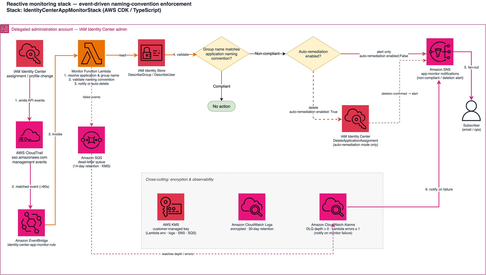

# Identity Center App Monitor

Event-driven AWS solution that monitors AWS Identity Center application assignments across an AWS Organization. The system validates that group names are included within application names and takes configurable remediation actions when mismatches are detected.

## Overview

This solution automatically monitors Identity Center application assignments and enforces naming conventions by validating that the group name appears as a whole word in the application name (case-insensitive, splitting on `-`, `_`, and whitespace). Note this is not a substring match -- `read` does not satisfy `sagemaker_readonly`. When non-compliant assignments are detected, the system can either:

- **Notification Mode** (default): Send alerts via SNS without modifying assignments
- **Auto-Deletion Mode**: Automatically delete non-compliant assignments and send notifications

### Group Name Matching

The solution supports two matching modes:

1. **Default Whole-Word Matching** (no regex): The group name must appear as a
   contiguous run of whole words in the application name, or vice versa
   - Example: Group `Developers` matches application `MyApp-Developers`
   - Counter-example: Group `Develop` does **not** match `MyApp-Developers` --
     it is a substring of a token, not a whole token

2. **Regex-Based Friendly Name Extraction**: Extract a friendly name from the full group name using a regex pattern
   - Example: Group `Dev-Team-AWS` with regex `^([^-]+)` extracts `Dev`, which matches application `MyApp-Dev`

### Key Features

- **Event-Driven Monitoring**: Captures Identity Center events typically within a few minutes (CloudTrail delivery latency) via EventBridge
- **Organization-Wide**: Monitors all accounts in your AWS Organization from a single deployment
- **Configurable Enforcement**: Choose between notification-only or automatic deletion
- **Comprehensive Logging**: Structured JSON logs for audit and troubleshooting
- **Retry Logic**: Automatic retry with exponential backoff for transient failures
- **Infrastructure as Code**: Fully automated deployment using AWS CDK

## Architecture

### Architecture Diagram



### Component Details

| Component | Purpose | Technology |
|-----------|---------|------------|
| **CloudTrail** | Captures Identity Center API events | AWS CloudTrail |
| **EventBridge** | Routes CloudTrail events to Lambda (typically within a few minutes) | AWS EventBridge |
| **Lambda Function** | Validates and remediates assignments | AWS Lambda (Python 3.12) |
| **Identity Center** | Source of assignment data | AWS IAM Identity Center |
| **Identity Store** | Resolves principal names | AWS Identity Store |
| **SNS Topics** | Multi-tier alert notifications | Amazon SNS |
| **CloudWatch** | Logging and monitoring | Amazon CloudWatch |

## Prerequisites

See the [repository README](../README.md) for prerequisites and required IAM permissions. Verify you are deploying to the delegated administrator account (not the management account).

## Installation

### 1. Install Dependencies

Install Node.js dependencies for CDK:
```bash
npm install
```

Install Python dependencies for Lambda function:
```bash
cd lambda
pip install -r requirements.txt
cd ..
```

### 2. Build the Project

Compile TypeScript code:
```bash
npm run build
```

### 3. Run Tests (Optional)

Run CDK tests:
```bash
npm test
```

Run Lambda tests:
```bash
cd lambda
pytest
cd ..
```

## Deployment

### Quick Start

The stack needs two deploy-time values, both resolvable with the AWS CLI from
the delegated administration account. `ManagementAccountId` must be the
organization's **management account** (Identity Center application ARNs embed
it), not the account you deploy from:

```bash
INSTANCE_ARN=$(aws sso-admin list-instances \
  --query 'Instances[0].InstanceArn' --output text)
MGMT_ACCOUNT_ID=$(aws organizations describe-organization \
  --query 'Organization.MasterAccountId' --output text)
```

For a basic deployment with notification-only mode:

```bash
cdk deploy \
  --parameters IdentityCenterInstanceArn=$INSTANCE_ARN \
  --parameters ManagementAccountId=$MGMT_ACCOUNT_ID
```

### Full Deployment with Auto-Deletion

To enable automatic deletion of non-compliant assignments:

```bash
cdk deploy \
  --context enableAutoDeletion=true \
  --parameters IdentityCenterInstanceArn=$INSTANCE_ARN \
  --parameters ManagementAccountId=$MGMT_ACCOUNT_ID
```

### Step-by-Step Deployment

1. **Bootstrap CDK** (first time only):
   ```bash
   cdk bootstrap aws://ACCOUNT-ID/REGION
   ```

2. **Review the changes** (optional):
   ```bash
   cdk diff \
     --parameters IdentityCenterInstanceArn=$INSTANCE_ARN \
     --parameters ManagementAccountId=$MGMT_ACCOUNT_ID
   ```

3. **Deploy the stack**:
   ```bash
   cdk deploy \
     --context enableAutoDeletion=false \
     --parameters IdentityCenterInstanceArn=$INSTANCE_ARN \
     --parameters ManagementAccountId=$MGMT_ACCOUNT_ID
   ```

4. **Note the outputs**: After deployment, CDK will output important values:
   - `IdentityCenterInstanceArnOutput`: The Identity Center instance ARN being monitored
   - `SnsTopicArn`: ARN of the SNS topic for notifications
   - `LambdaFunctionArn`: ARN of the Lambda function
   - `EventBridgeRuleName`: Name of the EventBridge rule
   - `LogGroupName`: CloudWatch Log Group name

### Using a Configuration File

You can set optional context parameters in `cdk.json`:

```json
{
  "context": {
    "enableAutoDeletion": false,
    "logRetentionDays": 30,
    "lambdaTimeout": 60,
    "lambdaMemory": 256
  }
}
```

The Identity Center Instance ARN and Management Account ID are CloudFormation parameters that must be provided at deployment time:
```bash
cdk deploy \
  --parameters IdentityCenterInstanceArn=$INSTANCE_ARN \
  --parameters ManagementAccountId=$MGMT_ACCOUNT_ID
```

**Finding Your Management Account ID:**
- Run: `aws organizations describe-organization --query 'Organization.MasterAccountId' --output text`
- Or check in AWS Console: AWS Organizations → Settings → Management account ID

## Configuration Parameters

| Parameter | Type | Required | Default | Description |
|-----------|------|----------|---------|-------------|
| `IdentityCenterInstanceArn` | CloudFormation Parameter | **Yes** | - | ARN of your Identity Center instance. Provided at deployment time via `--parameters`. Find this in IAM Identity Center → Settings. |
| `ManagementAccountId` | CloudFormation Parameter | **Yes** | - | 12-digit AWS Account ID of the organization's **management account** (Identity Center application ARNs embed it — this is not the delegated admin account you deploy from). Provided at deployment time via `--parameters`. |
| `GroupNameRegex` | CloudFormation Parameter | No | `""` (empty) | Optional regex pattern to extract friendly group name from full group name. The first capture group is used. Leave empty for default whole-word matching. |
| `enableAutoDeletion` | CDK Context | No | `false` | Enable automatic deletion of non-compliant assignments. When `false`, only notifications are sent. Set via `--context`. |
| `logRetentionDays` | CDK Context | No | `30` | Number of days to retain CloudWatch logs. Set via `--context`. |
| `lambdaTimeout` | CDK Context | No | `60` | Lambda function timeout in seconds. Set via `--context`. |
| `lambdaMemory` | CDK Context | No | `256` | Lambda function memory allocation in MB. Set via `--context`. |

### Configuration Examples

**Notification-only mode** (recommended for initial deployment):
```bash
cdk deploy \
  --parameters IdentityCenterInstanceArn=$INSTANCE_ARN \
  --parameters ManagementAccountId=$MGMT_ACCOUNT_ID
```

**Auto-deletion mode** (for enforcement):
```bash
cdk deploy \
  --context enableAutoDeletion=true \
  --parameters IdentityCenterInstanceArn=$INSTANCE_ARN \
  --parameters ManagementAccountId=$MGMT_ACCOUNT_ID
```

**Custom log retention**:
```bash
cdk deploy \
  --context logRetentionDays=90 \
  --parameters IdentityCenterInstanceArn=$INSTANCE_ARN \
  --parameters ManagementAccountId=$MGMT_ACCOUNT_ID
```

**With regex pattern for group name extraction**:
```bash
cdk deploy \
  --parameters IdentityCenterInstanceArn=$INSTANCE_ARN \
  --parameters ManagementAccountId=$MGMT_ACCOUNT_ID \
  --parameters GroupNameRegex="^([^-]+)"
```

## Group Name Regex Patterns

The `GroupNameRegex` parameter allows you to extract a friendly name from your full group names. This is useful when your group names follow a naming convention with prefixes, suffixes, or other structured patterns.

### How It Works

1. The regex pattern is applied to the full group name
2. The **first capture group** (content in parentheses) is extracted as the friendly name
3. The friendly name is matched against the application name (case-insensitive)
4. If no match is found or the regex fails, the full group name is used

### Common Regex Patterns

#### Extract Prefix Before First Dash

**Pattern**: `^([^-]+)`

**Use Case**: Group names like `Dev-Team-AWS`, `Prod-Admins-Cloud`

**Examples**:
- Group: `Dev-Team-AWS` → Friendly: `Dev`
- Group: `Prod-Admins-Cloud` → Friendly: `Prod`
- Application: `MyApp-Dev` → Matches `Dev`
- Application: `MyApp-Prod` → Matches `Prod`

```bash
cdk deploy \
  --parameters GroupNameRegex="^([^-]+)" \
  --parameters IdentityCenterInstanceArn=arn:aws:sso:::instance/ssoins-xxx \
  --parameters ManagementAccountId=$MGMT_ACCOUNT_ID
```

#### Extract Suffix After Last Dash

**Pattern**: `([^-]+)$`

**Use Case**: Group names like `AWS-Team-Dev`, `Cloud-Admins-Prod`

**Examples**:
- Group: `AWS-Team-Dev` → Friendly: `Dev`
- Group: `Cloud-Admins-Prod` → Friendly: `Prod`
- Application: `MyApp-Dev` → Matches `Dev`

```bash
cdk deploy \
  --parameters GroupNameRegex="([^-]+)$" \
  --parameters IdentityCenterInstanceArn=arn:aws:sso:::instance/ssoins-xxx \
  --parameters ManagementAccountId=$MGMT_ACCOUNT_ID
```

#### Extract Middle Segment

**Pattern**: `^[^-]+-([^-]+)`

**Use Case**: Group names like `AWS-Developers-Team`, `Cloud-Operations-Group`

**Examples**:
- Group: `AWS-Developers-Team` → Friendly: `Developers`
- Group: `Cloud-Operations-Group` → Friendly: `Operations`
- Application: `MyApp-Developers` → Matches `Developers`

```bash
cdk deploy \
  --parameters GroupNameRegex="^[^-]+-([^-]+)" \
  --parameters IdentityCenterInstanceArn=arn:aws:sso:::instance/ssoins-xxx \
  --parameters ManagementAccountId=$MGMT_ACCOUNT_ID
```

#### Extract Text Between Brackets

**Pattern**: `\[([^\]]+)\]`

**Use Case**: Group names like `Team [Dev] AWS`, `Admins [Prod] Cloud`

**Examples**:
- Group: `Team [Dev] AWS` → Friendly: `Dev`
- Group: `Admins [Prod] Cloud` → Friendly: `Prod`
- Application: `MyApp-Dev` → Matches `Dev`

```bash
cdk deploy \
  --parameters GroupNameRegex="\[([^\]]+)\]" \
  --parameters IdentityCenterInstanceArn=arn:aws:sso:::instance/ssoins-xxx \
  --parameters ManagementAccountId=$MGMT_ACCOUNT_ID
```

#### Extract Environment Code (Dev, Prod, Test, etc.)

**Pattern**: `(?i)(dev|prod|test|staging|qa)`

**Use Case**: Group names containing environment keywords (case-insensitive)

**Examples**:
- Group: `MyTeam-Dev-Engineers` → Friendly: `Dev`
- Group: `Prod-Admins-AWS` → Friendly: `Prod`
- Application: `MyApp-Dev` → Matches `Dev` (case-insensitive)

```bash
cdk deploy \
  --parameters GroupNameRegex="(?i)(dev|prod|test|staging|qa)" \
  --parameters IdentityCenterInstanceArn=arn:aws:sso:::instance/ssoins-xxx \
  --parameters ManagementAccountId=$MGMT_ACCOUNT_ID
```

#### Extract Alphanumeric Code

**Pattern**: `([A-Z]{2,4})`

**Use Case**: Group names with uppercase abbreviations

**Examples**:
- Group: `Team-DEV-AWS-Engineers` → Friendly: `DEV`
- Group: `PROD-Admins-Cloud` → Friendly: `PROD`
- Application: `MyApp-DEV` → Matches `DEV`

```bash
cdk deploy \
  --parameters GroupNameRegex="([A-Z]{2,4})" \
  --parameters IdentityCenterInstanceArn=arn:aws:sso:::instance/ssoins-xxx \
  --parameters ManagementAccountId=$MGMT_ACCOUNT_ID
```

### Testing Your Regex Pattern

Before deploying, you can test your regex pattern using Python:

```python
import re

# Your regex pattern
pattern = r"^([^-]+)"

# Test group names
test_groups = [
    "Dev-Team-AWS",
    "Prod-Admins-Cloud",
    "Test-Engineers"
]

for group in test_groups:
    match = re.search(pattern, group)
    if match and match.groups():
        friendly_name = match.group(1)
        print(f"{group} → {friendly_name}")
    else:
        print(f"{group} → No match (will use full name)")
```

### Validation Examples

#### Example 1: Prefix Extraction

**Configuration**:
- Regex: `^([^-]+)`
- Group: `Dev-Team-AWS`
- Application: `CustomerPortal-Dev`

**Result**: Compliant
- Extracted friendly name: `Dev`
- `dev` (lowercase) found in `customerportal-dev` (lowercase)

#### Example 2: No Regex (Default)

**Configuration**:
- Regex: (empty)
- Group: `Developers`
- Application: `MyApp-Developers`

**Result**: Compliant
- Full group name used: `Developers`
- `developers` found in `myapp-developers`

#### Example 3: Non-Compliant

**Configuration**:
- Regex: `^([^-]+)`
- Group: `Dev-Team-AWS`
- Application: `CustomerPortal-Prod`

**Result**: Non-Compliant
- Extracted friendly name: `Dev`
- `dev` NOT found in `customerportal-prod`
- Action: Notification sent (or deleted if auto-deletion enabled)

### Updating Regex After Deployment

You can update the regex pattern without redeploying. `aws lambda update-function-configuration --environment` **replaces the entire variable map**, so you must fetch the current map, modify a single key, and write the whole map back — otherwise required variables (`IDENTITY_CENTER_INSTANCE_ARN`, `MANAGEMENT_ACCOUNT_ID`, `SNS_TOPIC_ARN`, etc.) will be dropped and the function will start failing:

```bash
FUNCTION_NAME=identity-center-app-monitor

# 1. Fetch the current environment
aws lambda get-function-configuration \
  --function-name $FUNCTION_NAME \
  --query 'Environment.Variables' > /tmp/env.json

# 2. Update one variable in-place and wrap it in the expected --environment shape
python3 -c "import json; d=json.load(open('/tmp/env.json')); d['GROUP_NAME_REGEX']='^([^-]+)'; print(json.dumps({'Variables': d}))" > /tmp/env-update.json

# 3. Write the merged map back
aws lambda update-function-configuration \
  --function-name $FUNCTION_NAME \
  --environment file:///tmp/env-update.json
```

Or redeploy with the new parameter:

```bash
cdk deploy \
  --parameters GroupNameRegex="^([^-]+)" \
  --parameters IdentityCenterInstanceArn=<YOUR-INSTANCE-ARN> \
  --parameters ManagementAccountId=$MGMT_ACCOUNT_ID
```

## Subscribing to SNS Notifications

After deployment, you need to subscribe to the SNS topic to receive notifications.

### Get the SNS Topic ARN

The SNS topic ARN is displayed in the CDK deployment output. You can also retrieve it:

```bash
aws cloudformation describe-stacks \
  --stack-name IdentityCenterAppMonitorStack \
  --query 'Stacks[0].Outputs[?OutputKey==`SnsTopicArn`].OutputValue' \
  --output text
```

### Subscribe via Email

```bash
aws sns subscribe \
  --topic-arn arn:aws:sns:REGION:ACCOUNT-ID:identity-center-app-monitor-notifications \
  --protocol email \
  --notification-endpoint your-email@example.com
```

**Important**: Check your email and click the confirmation link to activate the subscription.

### Subscribe via SMS

```bash
aws sns subscribe \
  --topic-arn arn:aws:sns:REGION:ACCOUNT-ID:identity-center-app-monitor-notifications \
  --protocol sms \
  --notification-endpoint +1234567890
```

### Subscribe via AWS Console

1. Navigate to **SNS** in the AWS Console
2. Click **Topics** in the left menu
3. Find and click the **identity-center-app-monitor-notifications** topic
4. Click **Create subscription**
5. Select protocol (Email, SMS, HTTPS, etc.)
6. Enter endpoint (email address, phone number, etc.)
7. Click **Create subscription**
8. Confirm the subscription (check email for confirmation link)

### Multiple Subscriptions

You can add multiple subscriptions to notify different teams or channels:

```bash
# Subscribe security team
aws sns subscribe --topic-arn <TOPIC-ARN> --protocol email --notification-endpoint security@example.com

# Subscribe compliance team
aws sns subscribe --topic-arn <TOPIC-ARN> --protocol email --notification-endpoint compliance@example.com

# Subscribe Slack webhook
aws sns subscribe --topic-arn <TOPIC-ARN> --protocol https --notification-endpoint https://hooks.slack.com/services/YOUR/WEBHOOK/URL
```

## Notification Format

### Success Notification (Deletion)

**Subject**: `[Identity Center] Non-compliant assignment DELETED`

**Message** (fields marked *optional* are omitted when the source data is not available):
```json
{
  "timestamp": "2025-12-16T10:30:00Z",
  "eventType": "NON_COMPLIANT_ASSIGNMENT",
  "accountId": "123456789012",
  "applicationName": "MyApplication",
  "groupName": "DifferentGroup",
  "action": "DELETED",
  "status": "SUCCESS",
  "applicationArn": "arn:aws:sso:::application/ssoins-123/apl-456",
  "groupId": "f81d4fae-7dec-11d0-a765-00a0c91e6bf6",
  "initiatedBy": {
    "type": "AssumedRole",
    "arn": "arn:aws:sts::123456789012:assumed-role/AdminRole/alice",
    "principalId": "AROAEXAMPLEID:alice",
    "accountId": "123456789012"
  }
}
```

Optional fields: `applicationArn`, `groupId`, `initiatedBy`, `errorMessage`. There is no top-level `principalType` field — user assignments are exempt from compliance checks and never produce this notification.

### Notification-Only Mode

**Subject**: `[Identity Center] Non-compliant assignment NOTIFICATION_ONLY`

**Message**: Same format with `"action": "NOTIFICATION_ONLY"`

### Error Notification

**Subject**: `[Identity Center] ERROR: Failed to process assignment`

**Message**:
```json
{
  "timestamp": "2025-12-16T10:30:00Z",
  "eventType": "ERROR",
  "severity": "HIGH",
  "errorMessage": "Access denied when attempting to delete assignment",
  "context": {
    "applicationArn": "arn:aws:sso:::application/ssoins-123/apl-456",
    "accountId": "123456789012"
  }
}
```

## Monitoring and Logging

### CloudWatch Logs

All Lambda invocations are logged to CloudWatch Logs with structured JSON format:

```bash
# View recent logs
aws logs tail /aws/lambda/identity-center-app-monitor --follow

# Search logs for non-compliant assignments
aws logs filter-log-events \
  --log-group-name /aws/lambda/identity-center-app-monitor \
  --filter-pattern '{ $.validationResult = "Non-compliant" }'
```

### CloudWatch Metrics

Monitor Lambda function metrics:

```bash
# View Lambda invocations
aws cloudwatch get-metric-statistics \
  --namespace AWS/Lambda \
  --metric-name Invocations \
  --dimensions Name=FunctionName,Value=identity-center-app-monitor \
  --start-time 2025-12-15T00:00:00Z \
  --end-time 2025-12-16T00:00:00Z \
  --period 3600 \
  --statistics Sum
```

### Built-in CloudWatch alarms

The stack creates two CloudWatch alarms automatically, both wired to the
notification SNS topic. They exist because a silently-failing monitor stops
enforcing naming compliance with no signal — you would otherwise only notice
by the *absence* of expected notifications:

| Alarm | Fires when | Why it matters |
|-------|-----------|----------------|
| `MonitorErrorAlarm` | Lambda `Errors >= 1` in a 5-minute period | First-line signal that compliance validation is failing, before events exhaust retries |
| `DlqNotEmptyAlarm` | DLQ `ApproximateNumberOfMessagesVisible > 0` | Events failed all async retries and landed in the dead-letter queue; enforcement is degraded and messages expire after 14 days if not reprocessed |

Both publish to the `identity-center-app-monitor-notifications` topic —
subscribe an endpoint to it (see [Subscribing to SNS Notifications](#subscribing-to-sns-notifications))
to receive these alerts. When `DlqNotEmptyAlarm` fires, inspect the DLQ
(`identity-center-app-monitor-dlq`), fix the underlying failure, and redrive
the messages.

## Troubleshooting

### Events Not Being Captured

**Symptom**: No Lambda invocations when creating Identity Center assignments

**Possible Causes**:
1. No active CloudTrail trail logging write (management) events in the delegated
   admin (deployment) account, in this Region (us-east-1)
2. EventBridge rule not active
3. Identity Center events not matching the rule pattern

**Solutions**:
```bash
# Verify CloudTrail is enabled
aws cloudtrail describe-trails

# Check EventBridge rule status
aws events describe-rule --name identity-center-app-monitor-rule

# Enable the rule if disabled
aws events enable-rule --name identity-center-app-monitor-rule

# Check CloudTrail for Identity Center events
aws cloudtrail lookup-events \
  --lookup-attributes AttributeKey=EventSource,AttributeValue=sso.amazonaws.com \
  --max-results 10
```

### Lambda Function Errors

**Symptom**: Lambda function failing with errors in CloudWatch Logs

**Common Issues**:

1. **Missing IAM Permissions**
   ```bash
   # Check Lambda execution role
   aws lambda get-function --function-name identity-center-app-monitor \
     --query 'Configuration.Role'
   
   # Review IAM role policies
   aws iam get-role-policy --role-name <ROLE-NAME> --policy-name <POLICY-NAME>
   ```

2. **Invalid Identity Center Instance ARN**
   ```bash
   # Verify environment variable
   aws lambda get-function-configuration \
     --function-name identity-center-app-monitor \
     --query 'Environment.Variables'

   # Update if incorrect. --environment REPLACES the entire variable map,
   # so fetch the current map, change one key, and write the map back:
   aws lambda get-function-configuration \
     --function-name identity-center-app-monitor \
     --query 'Environment.Variables' > /tmp/env.json
   python3 -c "import json; d=json.load(open('/tmp/env.json')); d['IDENTITY_CENTER_INSTANCE_ARN']='arn:aws:sso:::instance/ssoins-xxx'; print(json.dumps({'Variables': d}))" > /tmp/env-update.json
   aws lambda update-function-configuration \
     --function-name identity-center-app-monitor \
     --environment file:///tmp/env-update.json
   ```

3. **Timeout Issues**
   ```bash
   # Increase timeout
   aws lambda update-function-configuration \
     --function-name identity-center-app-monitor \
     --timeout 120
   ```

### SNS Notifications Not Received

**Symptom**: No email/SMS notifications despite Lambda processing events

**Solutions**:

1. **Check Subscription Status**
   ```bash
   # List subscriptions
   aws sns list-subscriptions-by-topic \
     --topic-arn <TOPIC-ARN>
   
   # Look for "PendingConfirmation" status
   ```

2. **Confirm Subscription**
   - Check email spam folder for confirmation message
   - Resend confirmation:
   ```bash
   aws sns subscribe \
     --topic-arn <TOPIC-ARN> \
     --protocol email \
     --notification-endpoint your-email@example.com
   ```

3. **Check SNS Topic Permissions**
   ```bash
   aws sns get-topic-attributes --topic-arn <TOPIC-ARN>
   ```

4. **Test SNS Directly**
   ```bash
   aws sns publish \
     --topic-arn <TOPIC-ARN> \
     --message "Test notification" \
     --subject "Test"
   ```

### Deletion Not Working

**Symptom**: Non-compliant assignments not being deleted despite `enableAutoDeletion=true`

**Solutions**:

1. **Verify Configuration**
   ```bash
   aws lambda get-function-configuration \
     --function-name identity-center-app-monitor \
     --query 'Environment.Variables.ENABLE_AUTO_DELETION'
   ```

2. **Check IAM Permissions**
   - Ensure Lambda role has `sso:DeleteApplicationAssignment` permission
   ```bash
   aws iam simulate-principal-policy \
     --policy-source-arn <LAMBDA-ROLE-ARN> \
     --action-names sso:DeleteApplicationAssignment \
     --resource-arns "*"
   ```

3. **Review CloudWatch Logs**
   ```bash
   aws logs filter-log-events \
     --log-group-name /aws/lambda/identity-center-app-monitor \
     --filter-pattern "DELETE"
   ```

### High Lambda Costs

**Symptom**: Unexpected Lambda costs

**Solutions**:

1. **Check Invocation Count**
   ```bash
   aws cloudwatch get-metric-statistics \
     --namespace AWS/Lambda \
     --metric-name Invocations \
     --dimensions Name=FunctionName,Value=identity-center-app-monitor \
     --start-time 2025-12-01T00:00:00Z \
     --end-time 2025-12-16T00:00:00Z \
     --period 86400 \
     --statistics Sum
   ```

2. **Reduce Memory Allocation** (if processing is fast):
   ```bash
   aws lambda update-function-configuration \
     --function-name identity-center-app-monitor \
     --memory-size 128
   ```

3. **Check for Event Loops** (Lambda being triggered repeatedly)

### Access Denied Errors

**Symptom**: `AccessDeniedException` in CloudWatch Logs

**Solutions**:

1. **Verify Organization ID Condition**
   - Ensure IAM policy includes correct Organization ID
   ```bash
   aws organizations describe-organization --query 'Organization.Id'
   ```

2. **Check Cross-Account Permissions**
   - Verify Lambda can access Identity Center in member accounts

3. **Review IAM Policy**
   ```bash
   aws iam get-role-policy \
     --role-name <LAMBDA-ROLE-NAME> \
     --policy-name <POLICY-NAME>
   ```

## Updating Configuration

### Change Auto-Deletion Setting

To enable auto-deletion after initial deployment:

```bash
# Option 1: Update Lambda environment variable directly
# NOTE: --environment replaces the entire variable map. Fetch the current map,
# change ENABLE_AUTO_DELETION, and write it back — otherwise required variables
# (IDENTITY_CENTER_INSTANCE_ARN, MANAGEMENT_ACCOUNT_ID, SNS_TOPIC_ARN, ...) will
# be dropped and the function will start failing.
FUNCTION_NAME=identity-center-app-monitor

aws lambda get-function-configuration \
  --function-name $FUNCTION_NAME \
  --query 'Environment.Variables' > /tmp/env.json

python3 -c "import json; d=json.load(open('/tmp/env.json')); d['ENABLE_AUTO_DELETION']='true'; print(json.dumps({'Variables': d}))" > /tmp/env-update.json

aws lambda update-function-configuration \
  --function-name $FUNCTION_NAME \
  --environment file:///tmp/env-update.json

# Option 2: Redeploy with new context
cdk deploy \
  --context enableAutoDeletion=true \
  --parameters IdentityCenterInstanceArn=<INSTANCE-ARN> \
  --parameters ManagementAccountId=$MGMT_ACCOUNT_ID
```

### Update Lambda Code

After making code changes:

```bash
# Build and deploy
npm run build
cdk deploy
```

### Update Lambda Configuration

```bash
# Increase timeout
aws lambda update-function-configuration \
  --function-name identity-center-app-monitor \
  --timeout 120

# Increase memory
aws lambda update-function-configuration \
  --function-name identity-center-app-monitor \
  --memory-size 512
```

## Uninstalling

To remove the solution:

```bash
# Delete the CloudFormation stack
cdk destroy

# Confirm deletion when prompted
```

**Note**: This will delete all resources including CloudWatch Logs. SNS subscriptions will be automatically removed.

## Testing the Solution

### Pre-Deployment Testing

Run CDK and Lambda tests before deployment:

```bash
# Install test dependencies
npm install

# Run CDK infrastructure tests
npm test

# Run Lambda unit tests
cd lambda
pip install -r requirements.txt
pytest -v
cd ..
```

### Post-Deployment Testing

After deployment, validate the solution is working correctly:

#### Step 1: Verify Resources

```bash
# Check Lambda function exists
aws lambda get-function \
  --function-name identity-center-app-monitor \
  --query 'Configuration.{Name:FunctionName,Runtime:Runtime,Status:State}'

# Check EventBridge rule exists and is enabled
aws events describe-rule \
  --name identity-center-app-monitor-rule \
  --query '{Name:Name,State:State,EventPattern:EventPattern}'

# Check SNS topic exists
aws sns list-topics \
  --query 'Topics[?contains(TopicArn, `identity-center-app-monitor-notifications`)]'
```

#### Step 2: Subscribe to SNS Notifications

```bash
# Subscribe your email to receive test notifications
SNS_TOPIC_ARN=$(aws cloudformation describe-stacks \
  --stack-name IdentityCenterAppMonitorStack \
  --query 'Stacks[0].Outputs[?OutputKey==`SnsTopicArn`].OutputValue' \
  --output text)

aws sns subscribe \
  --topic-arn $SNS_TOPIC_ARN \
  --protocol email \
  --notification-endpoint your-email@example.com

# Check your email and confirm the subscription
```

#### Step 3: Manual Testing Scenarios

**Test 1: Compliant Group Assignment**

1. Create a compliant assignment in IAM Identity Center:
   - Application name: `MyApp-Production`
   - Group name: `MyApp-Developers` (with regex `^([^-]+)`, extracts "MyApp")
   - Expected: No notification, logs show "Compliant"

2. Verify in CloudWatch Logs:
   ```bash
   aws logs tail /aws/lambda/identity-center-app-monitor --follow
   ```

3. Look for log entry:
   ```json
   {
     "level": "INFO",
     "message": "Assignment is compliant",
     "validationResult": "Compliant",
     "groupName": "MyApp-Developers",
     "extractedName": "MyApp",
     "applicationName": "MyApp-Production"
   }
   ```

**Test 2: Non-Compliant Group Assignment (Notification Mode)**

1. Create a non-compliant assignment:
   - Application name: `MyApp-Production`
   - Group name: `OtherApp-Developers` (extracts "OtherApp")
   - Expected: SNS notification sent, no deletion

2. Check email for notification with subject:
   ```
   [Identity Center] Non-compliant assignment NOTIFICATION_ONLY
   ```

3. Verify assignment still exists in Identity Center console

4. Check CloudWatch Logs:
   ```bash
   aws logs filter-log-events \
     --log-group-name /aws/lambda/identity-center-app-monitor \
     --filter-pattern "Non-compliant" \
     --max-items 5
   ```

**Test 3: Non-Compliant Group Assignment (Auto-Deletion Mode)**

1. Enable auto-deletion (fetch the current environment and update the one
   variable — `--environment` replaces the entire map):
   ```bash
   aws lambda get-function-configuration \
     --function-name identity-center-app-monitor \
     --query 'Environment.Variables' > /tmp/env.json
   python3 -c "import json; d=json.load(open('/tmp/env.json')); d['ENABLE_AUTO_DELETION']='true'; print(json.dumps({'Variables': d}))" > /tmp/env-update.json
   aws lambda update-function-configuration \
     --function-name identity-center-app-monitor \
     --environment file:///tmp/env-update.json
   ```

2. Create a non-compliant assignment:
   - Application name: `MyApp-Production`
   - Group name: `TestApp-Users`
   - Expected: SNS notification sent AND assignment deleted

3. Check email for notification with subject:
   ```
   [Identity Center] Non-compliant assignment DELETED
   ```

4. Verify assignment was deleted in Identity Center console

5. Check CloudWatch Logs:
   ```bash
   aws logs filter-log-events \
     --log-group-name /aws/lambda/identity-center-app-monitor \
     --filter-pattern "DELETED" \
     --max-items 5
   ```

**Test 4: User Assignment (Should Pass)**

1. Create a user assignment (users are exempt from compliance checks):
   - Application name: `MyApp-Production`
   - User name: `john.doe@example.com`
   - Expected: No notification, assignment allowed

2. Verify in logs:
   ```json
   {
     "level": "INFO",
     "message": "User assignments are exempt from compliance validation",
     "principalType": "USER"
   }
   ```

#### Step 4: Automated Testing Script

Create a test script to validate all scenarios:

```bash
#!/bin/bash
# test-remediation.sh

set -e

echo "Testing Identity Center Remediation Solution"
echo "============================================="

# Resource names created by the CDK stack
FUNCTION_NAME="identity-center-app-monitor"
RULE_NAME="identity-center-app-monitor-rule"

# Test 1: Check Lambda function
echo "Test 1: Verifying Lambda function..."
aws lambda get-function --function-name $FUNCTION_NAME > /dev/null
echo "PASS: Lambda function exists"

# Test 2: Check EventBridge rule
echo "Test 2: Verifying EventBridge rule..."
RULE_STATE=$(aws events describe-rule --name $RULE_NAME --query 'State' --output text)
if [ "$RULE_STATE" == "ENABLED" ]; then
  echo "PASS: EventBridge rule is enabled"
else
  echo "FAIL: EventBridge rule is not enabled"
  exit 1
fi

# Test 3: Check SNS topic
echo "Test 3: Verifying SNS topic..."
SNS_TOPIC_ARN=$(aws cloudformation describe-stacks \
  --stack-name IdentityCenterAppMonitorStack \
  --query 'Stacks[0].Outputs[?OutputKey==`SnsTopicArn`].OutputValue' \
  --output text)
aws sns get-topic-attributes --topic-arn $SNS_TOPIC_ARN > /dev/null
echo "PASS: SNS topic exists: $SNS_TOPIC_ARN"

# Test 4: Check CloudWatch log group
echo "Test 4: Verifying CloudWatch log group..."
aws logs describe-log-groups \
  --log-group-name-prefix /aws/lambda/$FUNCTION_NAME > /dev/null
echo "PASS: CloudWatch log group exists"

# Test 5: Invoke Lambda with test event
echo "Test 5: Testing Lambda with sample event..."
cat > test-event.json <<EOF
{
  "version": "0",
  "id": "test-event-id",
  "detail-type": "AWS API Call via CloudTrail",
  "source": "aws.sso",
  "time": "$(date -u +%Y-%m-%dT%H:%M:%SZ)",
  "region": "us-east-1",
  "detail": {
    "eventName": "CreateApplicationAssignment",
    "requestParameters": {
      "applicationArn": "arn:aws:sso::123456789012:application/ssoins-test/apl-test",
      "principalId": "test-principal-id",
      "principalType": "GROUP"
    },
    "responseElements": {
      "applicationAssignment": {
        "applicationArn": "arn:aws:sso::123456789012:application/ssoins-test/apl-test",
        "principalId": "test-principal-id",
        "principalType": "GROUP"
      }
    }
  }
}
EOF

aws lambda invoke \
  --function-name $FUNCTION_NAME \
  --payload file://test-event.json \
  --cli-binary-format raw-in-base64-out \
  response.json > /dev/null

echo "PASS: Lambda invocation successful"
cat response.json | jq .
rm test-event.json response.json

echo ""
echo "All tests passed"
echo ""
echo "Next steps:"
echo "1. Subscribe to SNS topic: $SNS_TOPIC_ARN"
echo "2. Create test assignments in Identity Center"
echo "3. Monitor CloudWatch Logs: aws logs tail /aws/lambda/$FUNCTION_NAME --follow"
```

Make the script executable and run it:

```bash
chmod +x test-remediation.sh
./test-remediation.sh
```

### Monitoring Test Results

```bash
# View recent Lambda invocations
aws cloudwatch get-metric-statistics \
  --namespace AWS/Lambda \
  --metric-name Invocations \
  --dimensions Name=FunctionName,Value=identity-center-app-monitor \
  --start-time $(date -u -d '1 hour ago' +%Y-%m-%dT%H:%M:%S) \
  --end-time $(date -u +%Y-%m-%dT%H:%M:%S) \
  --period 300 \
  --statistics Sum

# View error rate
aws cloudwatch get-metric-statistics \
  --namespace AWS/Lambda \
  --metric-name Errors \
  --dimensions Name=FunctionName,Value=identity-center-app-monitor \
  --start-time $(date -u -d '1 hour ago' +%Y-%m-%dT%H:%M:%S) \
  --end-time $(date -u +%Y-%m-%dT%H:%M:%S) \
  --period 300 \
  --statistics Sum

# View recent logs
aws logs tail /aws/lambda/identity-center-app-monitor --since 1h

# Search for specific events
aws logs filter-log-events \
  --log-group-name /aws/lambda/identity-center-app-monitor \
  --filter-pattern "validationResult" \
  --max-items 10
```

### Expected Test Results

| Test Scenario | Expected Behavior | Verification |
|---------------|-------------------|--------------|
| Compliant group assignment | No notification, logs show "Compliant" | Check CloudWatch Logs |
| Non-compliant (notification mode) | SNS alert sent, assignment remains | Check email + Identity Center |
| Non-compliant (auto-delete mode) | SNS alert sent, assignment deleted | Check email + Identity Center |
| User assignment | No notification, assignment allowed | Check CloudWatch Logs |
| Invalid event format | Error logged, no crash | Check CloudWatch Logs |

## Security Considerations

### IAM Least Privilege

The Lambda execution role grants only the permissions required to observe, resolve, and remediate assignments:

- **Identity Center (`sso:*`), scoped by `aws:PrincipalOrgID` condition:**
  - `sso:DescribeApplication`, `sso:DescribeApplicationAssignment`, `sso:ListApplications` — read assignment context
  - `sso:DeleteApplicationAssignment` — remove non-compliant assignments (only exercised when auto-deletion is enabled)
  - `sso:DescribeInstance`, `sso:ListInstances` — resolve the Identity Store ID from the instance ARN (CloudTrail events omit `directoryId`)
- **Identity Store:** `identitystore:DescribeGroup`, `identitystore:DescribeUser` — resolve principal display names for logging and notifications
- **SNS:** `sns:Publish` on the stack's notification topic ARN only (not `*`)
- **KMS:** encrypt/decrypt on the stack's KMS key (required to publish to the KMS-encrypted SNS topic, to decrypt the Lambda environment variables, and to write to the encrypted log group and DLQ)
- **CloudWatch Logs:** `logs:CreateLogGroup`, `logs:CreateLogStream`, `logs:PutLogEvents` on the Lambda's own log group only

The `sso:*` actions do not support resource-level permissions, so their `Resource` element is `*`; the `aws:PrincipalOrgID` condition restricts them to principals in the same AWS Organization. All other statements are resource-scoped.

### Data Protection

- All API calls use HTTPS/TLS 1.2+
- CloudWatch Logs encrypted with AWS managed keys
- No PII or credentials stored in logs
- Consider encrypting SNS topic with KMS for sensitive environments

### Audit Trail

- All Lambda invocations logged to CloudWatch
- All API calls logged to CloudTrail
- All remediation actions logged and notified

## Cost Estimation

Illustrative monthly costs, using the per-service usage assumptions in the table below
and US East (N. Virginia) on-demand list pricing. Pricing varies by Region and changes
over time, so treat these as a worked example of the cost *shape* and model your own
numbers with the [AWS Pricing Calculator](https://calculator.aws/):

| Service | Usage | Estimated Cost |
|---------|-------|----------------|
| Lambda | 1,000 invocations/month, 256 MB, 1s avg duration | $0.20 |
| EventBridge | AWS service events (free) | $0.00 |
| SNS | 1,000 notifications/month | $0.50 |
| CloudWatch Logs | 1 GB/month | $0.50 |
| **Total** | | **~$1.20/month** |

Costs scale with:
- Number of Identity Center assignment changes
- Lambda execution time
- Number of SNS subscriptions
- Log retention period

## Project Structure

```
.
├── bin/
│   └── identity-center-app-monitor.ts    # CDK app entry point
├── lib/
│   └── identity-center-app-monitor-stack.ts  # CDK stack definition
├── lambda/
│   ├── handler.py                        # Main Lambda handler
│   ├── event_parser.py                   # Event parsing logic
│   ├── validation.py                     # Validation logic
│   ├── remediation.py                    # Remediation orchestration
│   ├── deletion.py                       # Deletion logic
│   ├── config.py                         # Configuration management
│   ├── identity_center_client.py         # Identity Center API client
│   ├── identity_store_client.py          # Identity Store API client
│   ├── sns_client.py                     # SNS client wrapper
│   ├── retry.py                          # Retry logic with backoff
│   ├── error_handler.py                  # Error handling
│   ├── structured_logging.py             # Logging utilities
│   ├── requirements.txt                  # Python dependencies
│   └── tests/                            # Python tests (test_*.py)
├── test/
│   └── identity-center-app-monitor-stack.test.ts  # CDK tests
├── cdk.json                              # CDK configuration
├── package.json                          # Node.js dependencies
├── tsconfig.json                         # TypeScript configuration
└── README.md                             # This file
```

## Development

### Build

```bash
npm run build
```

### Watch Mode

```bash
npm run watch
```

### Run Tests

```bash
# All tests
npm test

# CDK tests only
npm run test

# Lambda tests only
cd lambda
pytest
pytest -v  # Verbose output
pytest -k test_validation  # Run specific test
cd ..
```

### Type Checking and Tests

```bash
# TypeScript type check (tsc)
npm run build

# Python tests (run from lambda/)
cd lambda
python -m pytest tests
cd ..
```

## Troubleshooting: the monitor never fires

The stack can deploy successfully yet the monitor Lambda is never invoked when you
create or change an assignment. The two most common causes are environmental, not
bugs in the solution:

### No active CloudTrail trail

The monitor is triggered by IAM Identity Center API events that AWS CloudTrail
delivers to EventBridge. IAM Identity Center has no native EventBridge event source,
so the rule matches the `AWS API Call via CloudTrail` event type — and AWS only
delivers those events to EventBridge when **an active CloudTrail trail is logging
write (management) events** in the deployment Region. With no trail, the EventBridge
rule has nothing to match and the Lambda is never invoked.

- CloudTrail's free 90-day **Event History** does *not* feed EventBridge — a trail is
  required.
- A multi-Region organization trail satisfies this.

Verify a trail is logging:

```bash
aws cloudtrail describe-trails --region <region> \
  --query "trailList[].{Name:Name,Multi:IsMultiRegionTrail}" --output table
aws cloudtrail get-trail-status --region <region> --name <trail-name> --query IsLogging
```

### Wrong Region

IAM Identity Center is a global service; CloudTrail delivers its events only to the
**`us-east-1`** default event bus. An EventBridge rule created in any other Region
will never receive these events. Deploy the reactive monitoring stack in `us-east-1`.

### Event delivery is best-effort

Even with a trail in `us-east-1`, CloudTrail-to-EventBridge delivery is best-effort,
and events typically take a few minutes (not seconds) to arrive. Allow a few minutes
before concluding the monitor didn't fire, and do not treat auto-remediation as a
guaranteed, real-time control.
