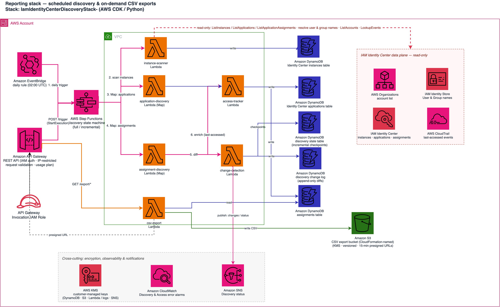

# IAM Identity Center Discovery Solution

An AWS solution for discovering, inventorying, and monitoring AWS IAM Identity Center instances, applications for instances, and application assignments across your AWS Organization with automated discovery, real-time monitoring, and CSV exports. AWS account assignments and permission sets are not currently inventoried as part of this solution.

---

## Table of Contents

- [What This Solution Does](#what-this-solution-does)
- [How It Works](#how-it-works)
- [Architecture](#architecture)
- [Key Features](#key-features)
- [Deployment Guide](#deployment-guide)
- [Running the Solution](#running-the-solution)
- [Accessing CSV Exports](#accessing-csv-exports)
- [Monitoring and Alerts](#monitoring-and-alerts)
- [Troubleshooting](#troubleshooting)
- [Data Model](#data-model)
- [Testing & Validation](#testing--validation)
- [Best Practices](#best-practices)

---

## What This Solution Does

This solution provides **automated discovery and inventory management** for AWS IAM Identity Center resources across your entire AWS Organization. It helps you answer critical questions:

- **What IAM Identity Center instances exist** across all your AWS accounts?
- **Which applications** are configured in each instance?
- **Who has access** to which applications (users and groups)?
- **What are the friendly names** of users and groups assigned to applications?
- **How can I export** this data for compliance, auditing, or reporting?

### Business Value

- **Visibility**: Complete inventory of IAM Identity Center resources across your organization
- **Compliance**: Automated reporting for access audits and compliance requirements
- **Security**: Track application assignments and identify potential security risks
- **Automation**: Scheduled discovery eliminates manual inventory processes
- **Integration**: CSV exports and API access for downstream systems and dashboards

---

## How It Works

### Discovery Process

1. **Instance Discovery**
   - Scans your AWS Organization for IAM Identity Center instances
   - Discovers instances across multiple AWS accounts
   - Records instance metadata (ARN, account ID, region, status)

2. **Application Discovery**
   - Enumerates all applications in each discovered instance
   - Captures application details (name, type, provider, status)
   - Identifies AWS-managed apps (Q Developer, SageMaker, etc.) and custom SAML apps

3. **Assignment Discovery**
   - Maps users and groups to applications
   - Resolves principal IDs to friendly names using Identity Store
   - Captures assignment metadata (status, timestamps, display names)

4. **Data Storage**
   - Stores all discovered data in DynamoDB tables
   - Maintains historical records for change tracking
   - Enables fast queries and efficient data retrieval

5. **CSV Export Generation**
   - Creates formatted CSV files with enriched data
   - Uploads to S3 with organized folder structure
   - Generates secure, time-limited download URLs

### Execution Flow

```
┌─────────────────────────────────────────────────────────────────┐
│                    EventBridge Schedule                          │
│                   (Daily at 2 AM UTC)                           │
└────────────────────────┬────────────────────────────────────────┘
                         │
                         ▼
┌─────────────────────────────────────────────────────────────────┐
│              Step Functions State Machine                        │
│           (iam-identity-center-discovery)                       │
└─────────────────────────────────────────────────────────────────┘
                         │
                         ▼
                ┌──────────────────┐
                │ Instance Scanner │
                └────────┬─────────┘
                         │
                         ▼
                ┌───────────────────────────┐
                │ Application Discovery     │
                │ (Map over instances)      │
                └────────┬──────────────────┘
                         │
                         ▼
                ┌───────────────────────────┐
                │ Assignment Discovery      │
                │ (Map over applications)   │
                └────────┬──────────────────┘
                         │
                         ▼
                ┌───────────────────────────┐
                │ Change Detection          │
                └────────┬──────────────────┘
                         │
                         ▼
                ┌───────────────────────────┐
                │ Access Tracker            │
                └────────┬──────────────────┘
                         │
                         ▼
                ┌─────────────────┐
                │   DynamoDB      │
                │   Tables        │
                │  - Instances    │
                │  - Applications │
                │  - Assignments  │
                │  - State        │
                │  - Change Log   │
                └─────────────────┘

┌─────────────────────────────────────────────────────────────────┐
│  CSV Export is NOT part of the Step Functions state machine.    │
│  It is triggered on-demand via API Gateway (see "Accessing CSV  │
│  Exports"), which invokes the CSV Export Lambda; the Lambda     │
│  reads the DynamoDB tables above and writes CSV files to S3.    │
└─────────────────────────────────────────────────────────────────┘
```

---

## Architecture

### Architecture Diagram



### Component Details

| Component | Purpose | Technology |
|-----------|---------|------------|
| **EventBridge Scheduler** | Triggers daily discovery at 2 AM UTC | AWS EventBridge |
| **Step Functions** | Orchestrates discovery workflow | AWS Step Functions |
| **Instance Scanner** | Discovers IAM IC instances | AWS Lambda (Python 3.12) |
| **Application Discovery** | Enumerates applications | AWS Lambda (Python 3.12) |
| **Assignment Discovery** | Maps user/group assignments | AWS Lambda (Python 3.12) |
| **Change Detection** | Diffs current vs. previous run, writes the change log, publishes SNS change/status notifications | AWS Lambda (Python 3.12) |
| **Access Tracker** | Enriches assignments with last-accessed data from CloudTrail; resolves group memberships cross-account | AWS Lambda (Python 3.12) |
| **CSV Export** | Generates CSV files | AWS Lambda (Python 3.12) |
| **DynamoDB Tables** | Stores discovered data | Amazon DynamoDB |
| **S3 Bucket** | Stores CSV exports | Amazon S3 |
| **API Gateway** | Provides REST API access | Amazon API Gateway |
| **CloudWatch** | Monitoring and logging | Amazon CloudWatch |
| **SNS Topics** | Alert notifications | Amazon SNS |

---

## Key Features

### Enhanced Discovery & Assignment Mapping
- **Multi-Account Discovery**: Automatically discovers IAM Identity Center instances across your entire AWS Organization
- **Application Enumeration**: Finds all applications (CodeWhisperer, Q Business, SageMaker, Custom SAML, etc.)
- **Enhanced Assignment Mapping**: Maps users and groups to applications with friendly names and metadata
- **Identity Resolution**: Converts principal IDs to readable names (e.g., "PowerUsers", "john.doe@example.com")
- **Cross-Account Support**: Works seamlessly across multiple AWS accounts with proper error handling

### Advanced Data Export & Analysis
- **Enhanced CSV Exports**: Applications, assignments, and comprehensive full datasets with enriched metadata
- **Multiple Export Formats**: Applications-only, assignments-only, and comprehensive full exports
- **Secure Downloads**: Time-limited, encrypted download URLs with organized S3 storage
- **Flexible Filtering**: Filter by account, region, principal type, application name, date ranges
- **Real-time Data**: Live data from actual AWS environment with performance optimization

### Infrastructure & Monitoring Features

This is a sample. It is built for production-like workloads and has not been through
an application security review — review and harden it against your own requirements
before deploying it to production. See [Security Configuration](#security-configuration).

- **Serverless Architecture**: Built on AWS Lambda, Step Functions, DynamoDB with enhanced error handling
- **Automated Scheduling**: Daily discovery with manual trigger capability and change detection
- **Monitoring**: CloudWatch integration with multi-tier alerting system
- **Batch Processing**: Batched DynamoDB writes, API call reuse, and application-name caching
- **Security Controls**: Encryption at rest and in transit, least-privilege IAM, audit logging, and IAM-authorized API endpoints

### Enhanced User Experience & Operations
- **Friendly Names**: Converts principal IDs to readable names with fallback handling
- **Rich Metadata**: Display names, email addresses, assignment status, and resolution indicators
- **Multiple Access Methods**: CSV exports, API access, dashboard integration, and programmatic access
- **Organized Storage**: Date-based file organization in S3 with lifecycle management
- **Comprehensive Alerting**: Multi-channel notifications for failures, performance issues, and status updates

### Security Features

- **Encryption**: All data encrypted at rest (KMS) and in transit (TLS 1.2+)
- **IAM Authentication**: API Gateway requires AWS SigV4 authentication
- **Least Privilege**: Lambda functions use minimal required permissions
- **Audit Logging**: All API calls and data access logged to CloudWatch
- **Secure URLs**: Time-limited presigned URLs for CSV downloads (15 minute expiry)
- **VPC Integration**: Lambda functions run in private subnets with VPC endpoints
- **IP Restriction**: Configurable IP address restrictions for API Gateway and S3 presigned URLs

## Project Structure

```
identity-center-reporting/
├── src/                                    # Source code
│   ├── lambdas/                           # Lambda function implementations
│   │   ├── instance-scanner/              # IAM Identity Center instance discovery (org + account-level)
│   │   │   └── index.py                      # Instance scanner Lambda handler
│   │   ├── application-discovery/         # Enhanced application enumeration & assignment mapping
│   │   │   └── index.py                      # Application discovery Lambda handler
│   │   ├── assignment-discovery/          # Assignment discovery with identity resolution
│   │   │   └── index.py                      # Assignment discovery Lambda handler
│   │   ├── access-tracker/               # Last-accessed enrichment from CloudTrail
│   │   │   └── index.py                      # Access tracker Lambda handler
│   │   ├── csv-export/                    # Multi-format CSV generation & secure download
│   │   │   └── index.py                      # CSV export Lambda handler
│   │   ├── change-detection/              # Incremental discovery & change tracking
│   │   │   └── index.py                      # Change detection Lambda handler
│   │   └── shared/                        # Shared utilities and models
│   │       ├── alarms.py                     # Alarm helper utilities
│   │       ├── alerting.py                   # Multi-tier notification & alert management
│   │       ├── incremental.py                # Incremental discovery helpers
│   │       ├── models.py                     # Enhanced data models & validation
│   │       ├── monitoring.py                 # Metrics & performance tracking
│   │       ├── performance.py                # Performance tracking helpers
│   │       ├── tracing.py                    # X-Ray tracing & debugging
│   │       └── utils.py                      # Common utilities & API helpers
│   └── step-functions/                    # Workflow orchestration definitions
│       └── discovery-state-machine.json      # Step Functions state machine definition
├── lib/                                   # AWS CDK infrastructure as code
│   ├── stacks/                            # CDK stack definitions
│   │   └── iam_identity_center_discovery_stack.py  # Main CDK stack with enhanced permissions
│   └── app.py                                # CDK application entry point
├── scripts/                               # Utility scripts (optional)
│   ├── cross-account-role-template.yaml      # CloudFormation template for cross-account roles
│   ├── deploy-cross-account-roles.py         # Cross-account role setup automation
│   ├── README.md                             # Scripts documentation
│   └── post-deployment/                   # Post-deployment utilities
│       ├── start_manual_discovery.py         # Manual discovery trigger utility
│       └── rollback-procedures.py            # Emergency rollback tool (manual use only)
├── tests/                                 # Comprehensive test suite
│   ├── __init__.py                           # Test package initialization
│   ├── conftest.py                           # Pytest fixtures & configuration
│   ├── requirements-test.txt                 # Test-specific dependencies
│   ├── test_application_name_caching.py      # Application name cache tests
│   ├── test_csv_matching.py                  # CSV row-matching tests
│   ├── test_delegated_admin.py               # Delegated-admin behavior tests
│   ├── test_integration.py                   # Integration tests
│   ├── test_lambda_builds.py                 # Lambda build validation tests
│   ├── test_lambda_unit_tests.py             # Lambda unit tests
│   ├── test_matching.py                      # Assignment-matching tests
│   ├── test_solution_comprehensive.py        # Comprehensive solution tests
│   └── test_xray_tracing.py                  # X-Ray tracing tests
├── csv_downloads/                         # Local CSV download directory (gitignored)
├── requirements.txt                       # Python dependencies (ranges, major-version capped)
├── requirements-lock.txt                  # exact validated versions for reproducible installs
├── cdk.json                               # CDK configuration
├── README.md                              # This file - comprehensive documentation
└── .gitignore                             # Git ignore patterns
```

**Key Directories:**

- **src/lambdas/** - All Lambda function code organized by function
- **src/lambdas/shared/** - Shared utilities, models, and helpers used across Lambda functions
- **lib/stacks/** - AWS CDK infrastructure definitions
- **scripts/post-deployment/** - Post-deployment testing and utility scripts
- **tests/** - Pre-deployment validation and testing suite
- **csv_downloads/** - Local directory for downloaded CSV exports (created automatically)

**Note:** The `scripts/` directory contains optional utility scripts that are not part of the automated deployment process.

## Quick Start Deployment

See the [repository README](../README.md) for prerequisites, required IAM permissions, and environment setup.

### 1. Deploy Solution

> **`CrossAccountExternalId` is required on every deploy, and has no default.**
> Generate a unique value once and reuse it for this stack and for
> `scripts/deploy-cross-account-roles.py` — the two must match, or cross-account
> discovery fails with `AccessDenied`:
>
> ```bash
> export IDC_EXTERNAL_ID="$(uuidgen)"   # keep this; the member-account roles need it too
> ```
>
> There is deliberately no default. The value used to be the literal
> `iam-identity-center-discovery`, hardcoded in this repository, which protected
> nothing: `sts:ExternalId` only stops a third party from having the role act on
> their behalf while the value is unknown to them. The stack rejects that published
> value if you pass it. The examples further down omit `CrossAccountExternalId` for
> brevity — add it to each one.

```bash
# Create a virtualenv on Python 3.12 first. Use python3.12 explicitly, not bare
# `python3`: aws-cdk-lib requires >= 3.10, and on macOS `python3` is still the
# system 3.9, where the install fails with "No matching distribution found for
# aws-cdk-lib" rather than a clear version error. The pinned version is in
# .python-version.
python3.12 -m venv .venv
source .venv/bin/activate
pip install -r requirements.txt

# Validate: synthesize the template and run the tests
pip install -r tests/requirements-test.txt
cdk synth --parameters CrossAccountExternalId="$IDC_EXTERNAL_ID"
python -m pytest tests

# Deploy to development (env defaults to dev; 0.0.0.0/0 chosen explicitly here)
cdk deploy \
  --parameters AllowedIpRange=0.0.0.0/0 \
  --parameters CrossAccountExternalId="$IDC_EXTERNAL_ID"

# Deploy to production with corporate-network-only access
CDK_ENVIRONMENT=prod cdk deploy \
  --parameters AllowedIpRange=10.0.0.0/8 \
  --parameters CrossAccountExternalId="$IDC_EXTERNAL_ID" \
  --require-approval never
```

**AllowedIpRange Parameter:** — **required, no default**
- CIDR block for allowed IP addresses. Restricts both the API Gateway endpoints and
  the S3 presigned URLs.
- ⚠️ **The presigned CSV download URLs carry personal data** (user emails, display
  names). On the API the CIDR sits alongside IAM authentication; on a presigned URL
  it is the **only** control left once the URL has been issued, because the URL is a
  bearer token in a query string. Pass `0.0.0.0/0` and a leaked URL — forwarded
  email, shell history, a ticket attachment — is redeemable from anywhere.
- There is deliberately **no default**. It used to default to `0.0.0.0/0` behind a
  synth-time notice, which meant a bare `cdk deploy` produced a stack whose personal-
  data exports were redeemable from any IP; a notice is not a control, and the
  deployer who skips the README skips the notice too. `0.0.0.0/0` is still accepted
  for demos — it just has to be typed, so it is a decision rather than an omission.
- `cdk synth`/`deploy` emits a notice about the open case until you acknowledge it
  with `-c acknowledgeOpenIpRange=true`.
- Examples:
  - Single IP: `203.0.113.45/32`
  - Subnet: `192.168.1.0/24`
  - Corporate network: `10.0.0.0/8`
  - Allow all (demo only, explicit): `0.0.0.0/0`

> **This stack processes personal data.** The tables it writes and the CSVs it
> exports name individuals and the applications they can reach. Under the
> [AWS shared responsibility model](https://aws.amazon.com/compliance/shared-responsibility-model/)
> the deploying account owns lawful basis, notice, data residency, retention, access
> control, and erasure for that data — which may engage the GDPR, UK GDPR, or
> CCPA/CPRA depending on your directory population. See
> [Data protection and your compliance obligations](../README.md#data-protection-and-your-compliance-obligations)
> in the repository README for the specifics this solution's design forces you to
> decide, and [AWS compliance resources](https://aws.amazon.com/compliance/) for
> general guidance. Nothing here is legal advice.

### 2. Validate Deployment

Follow the four checks in the repository README's
[Validate the deployment](../README.md#validate-the-deployment) section — stack
status, `sso-admin list-instances` reachability, first Step Functions run, and
DynamoDB row count. Once discovery has landed data, exercise the CSV export
Lambda directly to confirm the reporting path works end-to-end:

```bash
# Reporting-specific: invoke the CSV export Lambda after discovery has populated data
aws lambda invoke --function-name iam-identity-center-csv-export \
  --cli-binary-format raw-in-base64-out \
  --payload '{"export_type": "full", "filters": {}}' result.json
```

---

## Security Configuration

### IP Address Restrictions

The solution supports IP-based access control for enhanced security. This restricts access to:
- **API Gateway endpoints** - All export and trigger endpoints
- **S3 presigned URLs** - CSV file downloads

**Configuration Options:**

1. **Allow All (Default)**
   ```bash
   cdk deploy --parameters AllowedIpRange=0.0.0.0/0
   ```
   - Suitable for development and testing
   - No IP restrictions applied

2. **Corporate Network Only**
   ```bash
   CDK_ENVIRONMENT=prod cdk deploy --parameters AllowedIpRange=10.0.0.0/8
   ```
   - Restricts access to internal corporate network
   - Recommended for production environments

3. **Specific Subnet**
   ```bash
   CDK_ENVIRONMENT=prod cdk deploy --parameters AllowedIpRange=192.168.1.0/24
   ```
   - Restricts to a specific subnet
   - Useful for dedicated management networks

4. **Single IP Address**
   ```bash
   CDK_ENVIRONMENT=prod cdk deploy --parameters AllowedIpRange=203.0.113.45/32
   ```
   - Restricts to a single IP address
   - Maximum security for single-user access

**How It Works:**

- **API Gateway**: Resource policy denies requests from IPs outside the allowed range
- **S3 Presigned URLs**: Bucket policy denies GetObject requests from unauthorized IPs
- **IAM Authentication**: IP restrictions work in addition to IAM authentication (both required)

**Updating IP Restrictions:**

To change the allowed IP range after deployment:

```bash
# Update the stack with new IP range (redeploy with the new parameter value)
CDK_ENVIRONMENT=prod cdk deploy --parameters AllowedIpRange=NEW-CIDR-BLOCK
```

**Viewing Current Configuration:**

```bash
# Check CloudFormation outputs
aws cloudformation describe-stacks \
  --stack-name IamIdentityCenterDiscoveryStack-prod \
  --query 'Stacks[0].Outputs[?OutputKey==`AllowedIpRange`].OutputValue' \
  --output text
```

**Important Notes:**

- IP restrictions apply to both API Gateway and S3 presigned URLs
- Ensure your IP address is within the allowed range before deployment
- VPN or proxy users should use their exit IP address
- Changes require stack update (no downtime)
- Lambda functions are not affected (they use VPC endpoints)

---

## What You Get

### Enhanced Immediate Value
- **Complete Visibility**: Full inventory of IAM Identity Center resources with enriched metadata
- **Enhanced Assignment Mapping**: Who has access to what applications with friendly names and identity resolution
- **Automated Discovery**: Scheduled discovery with manual trigger capability and change detection
- **Advanced Data Export**: Multiple CSV export formats with comprehensive filtering and metadata
- **Real-time Monitoring**: CloudWatch dashboards with multi-tier alerting and escalation procedures
- **Performance Optimization**: Efficient processing with batch operations and API call optimization

### Verified Capabilities
Exercised against a live IAM Identity Center organization instance during development.
This is a sample, not a production-qualified deployment -- the list below describes what
the solution does, not a production readiness attestation:
- **Multi-Instance Discovery**: Discovers IAM Identity Center instances across AWS Organization
- **Comprehensive Application Enumeration**: CodeWhisperer, Q Business, SageMaker, Custom SAML, and more
- **Enhanced Assignment Mapping**: User/group assignments with friendly names, display names, and email addresses
- **Identity Resolution**: Converts principal IDs to readable names via the Identity
  Store, falling back to the raw principal ID when a principal cannot be resolved
  (for example, after it is deleted). The `name_resolved` field on each record
  reports which happened, so you can measure the rate in your own environment
  rather than relying on a figure from ours.
- **Multiple Export Formats**: Applications, assignments, and comprehensive full datasets
- **Cross-Account Discovery**: Seamless operation across multiple AWS accounts with proper error handling
- **Production Monitoring**: Comprehensive alerting system with escalation procedures

## Testing & Validation

The solution includes two types of testing:

### 1. Pre-Deployment Testing (Automated)

Run before deployment to validate code quality and infrastructure:

```bash
# Install test dependencies (once)
pip install -r tests/requirements-test.txt

# Run the test suite (no deployment)
python -m pytest tests

# Deploy dev (tests are manual/optional; run pytest beforehand)
cdk deploy --parameters AllowedIpRange=0.0.0.0/0

# Run tests with a minimum coverage threshold (pytest-cov is in tests/requirements-test.txt)
python -m pytest tests --cov=src --cov-fail-under=90
```

**Pre-Deployment Test Coverage:**
- Infrastructure validation (CDK/CloudFormation)
- Lambda function code syntax and imports
- Shared modules and utilities validation
- Requirements and dependencies checking
- AWS connectivity and permissions testing
- Configuration validation
- Lambda package validation
- Step Functions definition validation
- Error handling and logging patterns
- Resource naming conventions
- Security best practices validation
- Integration readiness assessment
- Functional component testing
- Deployment simulation

### 2. Post-Deployment API Testing (Manual)

Run after deployment AND after discovery has populated data:

```bash
# Step 1: Deploy the solution
cdk deploy --parameters AllowedIpRange=0.0.0.0/0

# Step 2: Trigger discovery to populate data
aws stepfunctions start-execution \
  --state-machine-arn arn:aws:states:REGION:ACCOUNT:stateMachine:iam-identity-center-discovery \
  --input '{"force_full_discovery": true, "discovery_run_id": "test-run"}'

# Step 3: Wait for discovery to complete (1-2 minutes)
# Check execution status in AWS Console or use:
aws stepfunctions describe-execution --execution-arn <execution-arn>

# Step 4: Test CSV exports
API_URL=$(aws cloudformation describe-stacks \
  --stack-name IamIdentityCenterDiscoveryStack-dev \
  --query 'Stacks[0].Outputs[?OutputKey==`ExportApiUrl`].OutputValue' \
  --output text)

awscurl --service execute-api --region <REGION> "${API_URL}/export/full"
```

**Post-Deployment Validation:**
- API Gateway endpoint availability
- AWS SigV4 authentication
- IAM authorization
- CSV export endpoints (applications, assignments, full)
- S3 presigned URL generation
- CSV file download functionality
- Error handling (403, 404, 500)

**Important:** API endpoint tests require data in DynamoDB. Running them before discovery will result in empty CSV files (headers only), which is technically correct but not a meaningful validation.

---

## Deployment Guide

### Step 1: Prerequisites Check

Ensure you have the following installed and configured:

```bash
# Check Python version (3.12+ required)
python3 --version

# Check AWS CLI
aws --version

# Check Node.js and npm (for CDK)
node --version
npm --version

# Check CDK CLI
cdk --version

# If CDK is not installed:
npm install -g aws-cdk@2.1128.0   # pinned to the validated version
```

### Step 2: Clone and Setup

```bash
# Clone the repository
git clone https://github.com/aws-samples/sample-iam-idc-application-discovery-reporting.git
cd sample-iam-idc-application-discovery-reporting/identity-center-reporting

# Create and activate virtual environment
python3 -m venv venv
source venv/bin/activate  # On Windows: venv\Scripts\activate

# Install Python dependencies
pip install -r requirements.txt

# Or, for a byte-identical environment matching what this solution was tested
# against, use the lock file instead:
#   pip install -r requirements-lock.txt
```

### Step 3: Configure AWS Credentials

```bash
# Option 1: AWS SSO (Recommended)
aws configure sso
aws sso login --profile your-profile-name

# Option 2: Traditional credentials
aws configure

# Verify credentials
aws sts get-caller-identity
```

### Step 4: Bootstrap CDK (First Time Only)

```bash
# Bootstrap CDK in your AWS account
cdk bootstrap aws://ACCOUNT-ID/REGION

# Example:
cdk bootstrap aws://123456789012/us-east-1
```

### Step 5: Deploy the Solution

```bash
# Deploy to development environment (recommended first)
cdk deploy --parameters AllowedIpRange=0.0.0.0/0

# For production deployment (skip interactive approval):
CDK_ENVIRONMENT=prod cdk deploy --parameters AllowedIpRange=10.0.0.0/8 --require-approval never
```

Run `cdk synth` and `python -m pytest tests` beforehand to catch issues before
the deploy. After the deploy, run the checks in [Step 6](#step-6-verify-deployment)
to confirm the stack landed and the discovery Lambdas can reach IAM Identity
Center.

### Step 6: Verify Deployment

```bash
# Check CloudFormation stack status
aws cloudformation describe-stacks \
  --stack-name IamIdentityCenterDiscoveryStack-dev \
  --query 'Stacks[0].StackStatus'

# List deployed resources
aws cloudformation list-stack-resources \
  --stack-name IamIdentityCenterDiscoveryStack-dev

# Get API Gateway endpoint
aws cloudformation describe-stacks \
  --stack-name IamIdentityCenterDiscoveryStack-dev \
  --query 'Stacks[0].Outputs[?OutputKey==`ExportApiUrl`].OutputValue' \
  --output text
```

### Step 7: Run Initial Discovery

After deployment, trigger the discovery workflow to populate data:

```bash
# Get the Step Functions state machine ARN
STATE_MACHINE_ARN=$(aws stepfunctions list-state-machines \
  --query 'stateMachines[?name==`iam-identity-center-discovery`].stateMachineArn' \
  --output text)

# Trigger discovery
EXECUTION_ARN=$(aws stepfunctions start-execution \
  --state-machine-arn $STATE_MACHINE_ARN \
  --input '{"force_full_discovery": true, "discovery_run_id": "initial-deployment-'$(date +%s)'"}' \
  --query 'executionArn' \
  --output text)

echo "Discovery started: $EXECUTION_ARN"

# Wait for completion (this may take 1-2 minutes)
echo "Waiting for discovery to complete..."
aws stepfunctions wait execution-succeeded --execution-arn $EXECUTION_ARN

# Check results
echo "Discovery completed! Checking results..."
aws dynamodb scan --table-name iam-identity-center-instances --select COUNT
aws dynamodb scan --table-name iam-identity-center-applications --select COUNT
aws dynamodb scan --table-name iam-identity-center-assignments --select COUNT
```

### Step 8: Test CSV Exports (Optional)

After discovery has run and data is populated, test the CSV export functionality:

```bash
# Get the API Gateway URL
API_URL=$(aws cloudformation describe-stacks \
  --stack-name IamIdentityCenterDiscoveryStack-dev \
  --query 'Stacks[0].Outputs[?OutputKey==`ExportApiUrl`].OutputValue' \
  --output text)

# Test CSV export using awscurl (install with: pip install awscurl==0.44)
awscurl --service execute-api --region us-east-1 "${API_URL}/export/full"
```

### Deployment Options

```bash
# Run tests only (no deployment)
python -m pytest tests

# Deploy dev without running tests first (not recommended for production)
cdk deploy --parameters AllowedIpRange=0.0.0.0/0

# Run tests with a coverage floor before deploying
python -m pytest tests --cov=src --cov-fail-under=90

# Deploy to a specific region
CDK_DEFAULT_REGION=us-west-2 cdk deploy --parameters AllowedIpRange=0.0.0.0/0
```

### Deployment Parameters

The solution supports several CloudFormation parameters that can be configured during deployment:

#### AllowedIpRange (Optional)
- **Description**: CIDR block for IP addresses allowed to access API Gateway and S3 presigned URLs
- **Default**: `0.0.0.0/0` (allows all)
- **Example**: `10.0.0.0/8` or `192.168.1.0/24`
- **Use Case**: Restrict API access to specific IP ranges for enhanced security

#### CrossAccountExternalId (Required)
- **Description**: The `sts:ExternalId` the solution's Lambdas present when assuming the
  discovery role in each member account
- **Default**: none — the deploy fails without it, by design
- **Format**: at least 16 characters from `A-Za-z0-9+=,.@:/-`; `uuidgen` output works
- **Must match**: the `CrossAccountExternalId` given to
  `scripts/deploy-cross-account-roles.py`, and therefore the `sts:ExternalId` condition on
  each member-account role's trust policy. A mismatch surfaces as `AccessDenied` on
  `sts:AssumeRole` inside the Lambda while the state machine still reports `SUCCEEDED`.
- **Use Case**: Confused-deputy protection on the cross-account role. There is no default
  because the value used to be the literal `iam-identity-center-discovery`, published in
  this repository — and an `ExternalId` only works while it is unknown to the party you
  are guarding against. The stack rejects that specific value, and rejects anything under
  16 characters; a length check alone would let the old one through at 29.
- **`NoEcho`**: yes — the value is not echoed in CloudFormation console output

#### enableDynamoDbPitr (Optional, CDK context)
- **Description**: Enable Point-in-Time Recovery for DynamoDB tables
- **Default**: `true`
- **Values**: `true` or `false`
- **Use Case**: Continuous backups for the last 35 days (additional cost applies). These
  tables are the audit record of who had access to what, so a bad discovery run or an
  accidental delete should be recoverable — which is also what `AwsSolutions-DDB3`
  checks. Set `-c enableDynamoDbPitr=false` only for throwaway environments where the
  continuous-backup cost matters more than the recovery window.

#### disableExecuteApiEndpoint (Optional, CDK context)
- **Description**: Turn off the export API's default `execute-api.amazonaws.com` endpoint
- **Default**: `false` (the endpoint stays reachable)
- **Values**: `true` or `false`
- **Use Case**: This stack creates no custom domain, so the default endpoint is the only
  way to reach the export API — disabling it out of the box would deploy an API that
  nothing can call, including the requests documented below. Access is gated by IAM
  authentication and the `AllowedIpRange` resource policy regardless, so the endpoint is
  reachable rather than open. Set `-c disableExecuteApiEndpoint=true` once you have put a
  custom domain in front of the API, which is the point where the default endpoint is
  extra surface rather than the only entry point.

#### DelegatedAdminAccountId (Optional)
- **Description**: AWS Account ID of the delegated administrator for IAM Identity Center
- **Default**: Empty (uses current account)
- **Format**: 12-digit AWS Account ID (e.g., `123456789012`)
- **Use Case**: When IAM Identity Center is managed by a delegated admin account different from where the solution is deployed
- **Behavior**:
  - If empty or matches current account: Uses current account credentials
  - If different from current account: Assumes cross-account role in the delegated admin account
  - Requires the cross-account discovery role to be deployed in the delegated admin account

**Example deployment with parameters:**
```bash
# Deploy with custom IP restriction and delegated admin account
cdk deploy \
  --parameters AllowedIpRange=10.0.0.0/8 \
  --parameters CrossAccountExternalId="$IDC_EXTERNAL_ID" \
  --parameters DelegatedAdminAccountId=123456789012
```

Then deploy the member-account roles with the *same* ExternalId, or every
cross-account call is denied:

```bash
python scripts/deploy-cross-account-roles.py --external-id "$IDC_EXTERNAL_ID"
```

### Post-Deployment Steps

1. **Configure SNS Subscriptions** (for alerts)
   ```bash
   # Subscribe email to critical alerts topic
   aws sns subscribe \
     --topic-arn arn:aws:sns:REGION:ACCOUNT:iam-identity-center-critical-alerts \
     --protocol email \
     --notification-endpoint your-email@example.com
   ```

2. **Run Initial Discovery**
   ```bash
   # Trigger manual discovery
   aws stepfunctions start-execution \
     --state-machine-arn arn:aws:states:REGION:ACCOUNT:stateMachine:iam-identity-center-discovery \
     --input '{"force_full_discovery": true, "discovery_run_id": "initial-deployment"}'
   ```

3. **Verify Data Collection**
   ```bash
   # Check DynamoDB tables
   aws dynamodb scan --table-name iam-identity-center-instances --max-items 5
   aws dynamodb scan --table-name iam-identity-center-applications --max-items 5
   aws dynamodb scan --table-name iam-identity-center-assignments --max-items 5
   ```

4. **Test CSV Exports** (after discovery completes)
   ```bash
   # Test CSV export via API Gateway
   API_URL=$(aws cloudformation describe-stacks \
     --stack-name IamIdentityCenterDiscoveryStack-dev \
     --query 'Stacks[0].Outputs[?OutputKey==`ExportApiUrl`].OutputValue' \
     --output text)
   
   awscurl --service execute-api --region us-east-1 "${API_URL}/export/full"
   ```

---

## Running the Solution

### Automated Execution (Default)

The solution runs automatically every day at 2 AM UTC via EventBridge Scheduler. No manual intervention required.

To modify the schedule:
1. Edit `lib/stacks/iam_identity_center_discovery_stack.py`
2. Find the `create_scheduling()` method
3. Update the `schedule` parameter in the EventBridge Rule (currently set to daily at 2 AM UTC)
4. Redeploy: `cdk deploy --parameters AllowedIpRange=<your-range>`

### Manual Execution via Step Functions

#### Option 1: AWS Console

1. Navigate to **Step Functions** in AWS Console
2. Select state machine: `iam-identity-center-discovery`
3. Click **Start execution**
4. Enter input JSON:
   ```json
   {
     "force_full_discovery": true,
     "discovery_run_id": "manual-2025-11-20"
   }
   ```
5. Click **Start execution**
6. Monitor execution in real-time

#### Option 2: AWS CLI

```bash
# Get the state machine ARN
STATE_MACHINE_ARN=$(aws stepfunctions list-state-machines \
  --query 'stateMachines[?name==`iam-identity-center-discovery`].stateMachineArn' \
  --output text)

# Start execution with full discovery
aws stepfunctions start-execution \
  --state-machine-arn $STATE_MACHINE_ARN \
  --input '{"force_full_discovery": true, "discovery_run_id": "manual-'$(date +%s)'"}'

# Start execution with specific parameters
aws stepfunctions start-execution \
  --state-machine-arn $STATE_MACHINE_ARN \
  --input '{
    "force_full_discovery": true,
    "discovery_run_id": "manual-test",
    "account_filter": "123456789012"
  }'
```

#### Option 3: Python Script

```python
import boto3
import json
from datetime import datetime

# Initialize Step Functions client
sfn_client = boto3.client('stepfunctions', region_name='us-east-1')

# Get state machine ARN
response = sfn_client.list_state_machines()
state_machine_arn = next(
    sm['stateMachineArn'] 
    for sm in response['stateMachines'] 
    if sm['name'] == 'iam-identity-center-discovery'
)

# Start execution
execution_input = {
    "force_full_discovery": True,
    "discovery_run_id": f"manual-{datetime.now().strftime('%Y%m%d-%H%M%S')}"
}

response = sfn_client.start_execution(
    stateMachineArn=state_machine_arn,
    input=json.dumps(execution_input)
)

print(f"Execution started: {response['executionArn']}")
```

### Monitoring Execution

```bash
# Get execution ARN from start-execution output
EXECUTION_ARN="arn:aws:states:REGION:ACCOUNT:execution:iam-identity-center-discovery:EXECUTION-ID"

# Check execution status
aws stepfunctions describe-execution \
  --execution-arn $EXECUTION_ARN \
  --query '{Status: status, StartDate: startDate, StopDate: stopDate}'

# Get execution history
aws stepfunctions get-execution-history \
  --execution-arn $EXECUTION_ARN \
  --max-results 10

# View CloudWatch logs
aws logs tail /aws/stepfunctions/iam-identity-center-discovery --follow
```

---

## Accessing CSV Exports

### Method 1: API Gateway (Recommended)

The solution provides a REST API for generating and downloading CSV exports.

#### Get API Endpoint

```bash
# Get the API Gateway URL
API_URL=$(aws cloudformation describe-stacks \
  --stack-name IamIdentityCenterDiscoveryStack-dev \
  --query 'Stacks[0].Outputs[?OutputKey==`ExportApiUrl`].OutputValue' \
  --output text)

echo "API Endpoint: $API_URL"
```

#### Using Python with AWS SigV4 Authentication

```python
import boto3
import requests
from botocore.auth import SigV4Auth
from botocore.awsrequest import AWSRequest

# Initialize session
session = boto3.Session()
credentials = session.get_credentials()

# API endpoint
api_url = "https://YOUR-API-ID.execute-api.us-east-1.amazonaws.com/prod"

# Export endpoints
endpoints = {
    "applications": f"{api_url}/export/applications",
    "assignments": f"{api_url}/export/assignments",
    "full": f"{api_url}/export/full"
}

# Make authenticated request
def get_csv_export(endpoint_url, filters=None):
    # Add query parameters if filters provided
    if filters:
        params = '&'.join([f"{k}={v}" for k, v in filters.items()])
        endpoint_url = f"{endpoint_url}?{params}"
    
    # Create and sign request
    request = AWSRequest(method='GET', url=endpoint_url)
    SigV4Auth(credentials, "execute-api", "us-east-1").add_auth(request)
    
    # Make request
    response = requests.get(endpoint_url, headers=dict(request.headers))
    
    if response.status_code == 200:
        data = response.json()
        # Download CSV from presigned URL
        csv_response = requests.get(data['download_url'])
        return csv_response.text
    else:
        raise Exception(f"API Error: {response.status_code} - {response.text}")

# Example: Export all assignments
csv_data = get_csv_export(endpoints['assignments'])
with open('assignments.csv', 'w') as f:
    f.write(csv_data)

# Example: Export with filters
csv_data = get_csv_export(
    endpoints['assignments'],
    filters={'principal_type': 'GROUP', 'account_id': '123456789012'}
)
```

#### Using curl with AWS SigV4

```bash
# Install awscurl if not already installed
pip install awscurl==0.44

# Export applications
awscurl --service execute-api \
  --region us-east-1 \
  "https://YOUR-API-ID.execute-api.us-east-1.amazonaws.com/prod/export/applications"

# Export assignments with filters
awscurl --service execute-api \
  --region us-east-1 \
  "https://YOUR-API-ID.execute-api.us-east-1.amazonaws.com/prod/export/assignments?principal_type=GROUP"

# Export full dataset
awscurl --service execute-api \
  --region us-east-1 \
  "https://YOUR-API-ID.execute-api.us-east-1.amazonaws.com/prod/export/full"
```

### Method 2: Direct S3 Access

```bash
# Get S3 bucket name
BUCKET_NAME=$(aws cloudformation describe-stack-resources \
  --stack-name IamIdentityCenterDiscoveryStack-dev \
  --query 'StackResources[?ResourceType==`AWS::S3::Bucket`].PhysicalResourceId' \
  --output text)

# List available exports
aws s3 ls s3://$BUCKET_NAME/exports/ --recursive

# Download specific export
aws s3 cp s3://$BUCKET_NAME/exports/full/2025/11/20/full_export_20251120_023615.csv ./

# Download all exports from today
aws s3 sync s3://$BUCKET_NAME/exports/full/$(date +%Y/%m/%d)/ ./exports/
```

### Method 3: Lambda Function Direct Invocation

```bash
# Invoke CSV export Lambda directly
aws lambda invoke \
  --function-name iam-identity-center-csv-export \
  --payload '{"export_type": "full", "filters": {}}' \
  --cli-binary-format raw-in-base64-out \
  response.json

# View response
cat response.json | jq .
```

### Available Export Types

| Export Type | Endpoint | Columns | Description |
|-------------|----------|---------|-------------|
| **Applications** | `/export/applications` | 13 | Applications with instance metadata (no assignment data) |
| **Assignments** | `/export/assignments` | 14 | Assignments with friendly names, identity resolution, and application names |
| **Full** | `/export/full` | 26 | Combined dataset with instances, applications, AND assignments |

**Key Differences:**

- **Applications Export**: Contains only application data with 13 columns. Use this for application inventory without assignment information.
- **Assignments Export**: Contains assignment data with 14 columns including principal names, display names, and emails. Includes application names for context.
- **Full Export**: Comprehensive dataset with 26 columns combining instance, application, and assignment data. Use this for complete reporting and analysis.

### Available Filters

| Filter | Type | Example | Description |
|--------|------|---------|-------------|
| `account_id` | String | `123456789012` | Filter by AWS account ID |
| `region` | String | `us-east-1` | Filter by AWS region |
| `principal_type` | String | `GROUP` or `USER` | Filter assignments by principal type |
| `application_name` | String | `QBusiness` | Filter by application name (partial match) |
| `date_from` | ISO Date | `2025-01-01` | Filter by start date |
| `date_to` | ISO Date | `2025-12-31` | Filter by end date |

### CSV Export Format

#### Assignments Export Columns

```csv
Instance ARN,Instance Type,Instance Status,Identity Store ID,Account ID,Region,
Application ARN,Application Name,Application Status,Assignment ID,Principal ID,
Principal Type,Principal Name,Principal Display Name,Principal Email,
Name Resolved,Assignment Status,Last Updated
```

**Example Row:**
```csv
arn:aws:sso:::instance/ssoins-123,organization,ACTIVE,d-1234abcdef,1234567891011,us-east-1,
arn:aws:sso::1234567891011:application/ssoins-123/apl-456,QDefaultProfile,ENABLED,
apl-456#12345678-0000-0000-0000-1234567890,12345678-0000-0000-0000-1234567890,
GROUP,PowerUsers,Power Users Group,,Yes,ACTIVE,2025-11-20T01:41:52Z
```


---

## Enhanced Data Model

### Instances Table
- **Primary Key**: `instance_arn`
- **GSI**: `account_id-index` for cross-account queries
- **Enhanced Fields**: Instance type, status, identity store ID, region metadata

### Applications Table  
- **Primary Key**: `application_arn`
- **Sort Key**: `instance_arn`
- **GSI**: `instance_arn-index` for efficient instance-based queries
- **Enhanced Fields**: Provider details, portal options, sign-in configuration, metadata

### Assignments Table (Enhanced)
- **Primary Key**: `assignment_id`
- **GSI**: `application_arn-index`, `principal_id-index` for efficient lookups
- **Enhanced Fields**: 
  - `principal_name` - Friendly name (e.g., "PowerUsers", "john.doe@example.com")
  - `principal_display_name` - Display name from Identity Store
  - `principal_email` - Email address for users
  - `name_resolved` - Boolean indicating successful name resolution
  - `resolution_error` - Error message if name resolution failed
  - Assignment status and metadata

### Sample Enhanced Assignment Record
```json
{
  "assignment_id": "apl-123456789#12345678-0000-0000-0000-1234567890",
  "application_arn": "arn:aws:sso::123456789012:application/ssoins-123/apl-123456789",
  "application_name": "QBusiness-application-example",
  "principal_id": "12345678-0000-0000-0000-1234567890",
  "principal_type": "GROUP",
  "principal_name": "PowerUsers",
  "principal_display_name": "Power Users Group",
  "principal_email": null,
  "name_resolved": true,
  "assignment_status": "ACTIVE",
  "instance_arn": "arn:aws:sso:::instance/ssoins-123456789",
  "last_updated": "2025-10-30T17:39:38.966910Z"
}
```

### CSV Export Formats

#### Assignments Export Columns
| Column | Description | Example |
|--------|-------------|---------|
| Assignment ID | Unique assignment identifier | `apl-123#group-456` |
| Application ARN | Application resource ARN | `arn:aws:sso::123:application/...` |
| Application Name | Friendly application name | `QBusiness-application-example` |
| Principal ID | Identity Store principal ID | `12345678-0000-0000-0000-1234567890` |
| Principal Type | USER or GROUP | `GROUP` |
| Principal Name | **Friendly name** | `PowerUsers` |
| Principal Display Name | Display name from Identity Store | `Power Users Group` |
| Principal Email | Email address (users only) | `john.doe@example.com` |
| Name Resolved | Resolution success indicator | `Yes` / `No` |
| Assignment Status | Assignment status | `ACTIVE` |
| Last Updated | Last modification timestamp | `2025-10-30T17:39:38Z` |

## Enhanced Monitoring & Alerting

The solution includes a comprehensive multi-tier monitoring and alerting system:

### CloudWatch Monitoring
- **Lambda Function Metrics**: Error rates, duration, throttling, and custom metrics
- **Step Functions Tracking**: Execution success/failure rates, duration, and state transitions
- **DynamoDB Metrics**: Read/write capacity, throttling, and performance metrics
- **API Gateway Metrics**: Request rates, error rates, and latency tracking
- **Custom Metrics**: Discovery success rates, assignment resolution rates, and data quality metrics

### Multi-Tier Alerting System
- **Critical Alerts**: Service-impacting issues requiring immediate attention
- **Warning Alerts**: Issues that may impact service if not addressed
- **Access Issue Alerts**: Permission-related failures across accounts
- **Status Updates**: Informational messages and discovery completion notifications

### Alert Routing & Escalation
- **SNS Topics**: Separate topics for different alert severities and types
- **Automatic Escalation**: Critical alerts escalate after repeated failures
- **Multi-Channel Notifications**: Email, Slack, Teams, and PagerDuty integration
- **Context-Rich Alerts**: Include relevant logs, metrics, and recommended actions

### CloudWatch Alarms
- **Lambda Error Rate**: ≥ 3 errors per 5-minute period for 2 consecutive periods (Critical)
- **Lambda Memory Utilization**: > 80% average for 3 consecutive 5-minute periods (Warning)
- **DynamoDB Read Throttling**: ≥ 1 throttled read event in 1 minute (Warning)
- **API Gateway 4XX Errors**: ≥ 5 in 5 minutes for 2 consecutive periods (Warning); ≥ 10 in 5 minutes (Access Issues)

### Alert Integration Examples
```python
# Send discovery failure alert
from shared.alerting import send_discovery_failure_alert

send_discovery_failure_alert(
    component="application-discovery",
    error="Access denied to Identity Store",
    discovery_run_id=discovery_run_id,
    account_id="123456789012"
)

# Send access issue alert
from shared.alerting import alert_manager

alert_manager.send_access_issue_alert(
    account_id="123456789012",
    service="identitystore",
    error_message="Access Denied",
    error_count=3
)
```

## Monitoring and Alerts

### CloudWatch Alarms and SNS Topics

Alarms and SNS topics are created automatically as part of the stack. No dashboards are created by this solution — to review alarm state, navigate to **CloudWatch > Alarms** in the AWS Console.

**Key Metrics Monitored:**
- Lambda function invocations, errors, and duration
- Step Functions execution success/failure rates
- DynamoDB read/write capacity and throttling
- API Gateway request rates and latency
- Custom metrics for discovery success rates

### CloudWatch Alarms

Pre-configured alarms for critical issues:

| Alarm | Threshold | Action |
|-------|-----------|--------|
| Lambda Error Rate | ≥ 3 errors per 5-min period for 2 consecutive periods | SNS notification to critical alerts topic |
| Lambda Memory Utilization | > 80% average for 3 consecutive 5-min periods | SNS notification to warning alerts topic |
| DynamoDB Read Throttling | ≥ 1 throttled read event in 1 min | SNS notification to warning alerts topic |
| API Gateway 4XX Errors (warning) | ≥ 5 in 5 min for 2 consecutive periods | SNS notification to warning alerts topic |
| API Gateway 4XX Errors (access issues) | ≥ 10 in 5 min | SNS notification to access-issues topic (`iam-identity-center-access-issues`) |

### SNS Topics for Alerts

```bash
# Subscribe to critical alerts
aws sns subscribe \
  --topic-arn arn:aws:sns:REGION:ACCOUNT:iam-identity-center-critical-alerts \
  --protocol email \
  --notification-endpoint your-email@example.com

# Subscribe to warning alerts
aws sns subscribe \
  --topic-arn arn:aws:sns:REGION:ACCOUNT:iam-identity-center-warning-alerts \
  --protocol email \
  --notification-endpoint your-email@example.com

# Subscribe to discovery status updates
aws sns subscribe \
  --topic-arn arn:aws:sns:REGION:ACCOUNT:iam-identity-center-discovery-status \
  --protocol email \
  --notification-endpoint your-email@example.com
```

### Viewing Logs

```bash
# View Lambda function logs
aws logs tail /aws/lambda/iam-identity-center-instance-scanner --follow
aws logs tail /aws/lambda/iam-identity-center-application-discovery --follow
aws logs tail /aws/lambda/iam-identity-center-csv-export --follow

# View Step Functions logs
aws logs tail /aws/stepfunctions/iam-identity-center-discovery --follow

# Search for errors in last hour
aws logs filter-log-events \
  --log-group-name /aws/lambda/iam-identity-center-application-discovery \
  --start-time $(date -u -d '1 hour ago' +%s)000 \
  --filter-pattern "ERROR"

# Get execution metrics
aws cloudwatch get-metric-statistics \
  --namespace AWS/Lambda \
  --metric-name Errors \
  --dimensions Name=FunctionName,Value=iam-identity-center-application-discovery \
  --start-time $(date -u -d '24 hours ago' +%Y-%m-%dT%H:%M:%S) \
  --end-time $(date -u +%Y-%m-%dT%H:%M:%S) \
  --period 3600 \
  --statistics Sum
```

---

## Troubleshooting

### Issue 1: No Instances Discovered

**Symptoms:**
- Step Functions execution succeeds but no data in DynamoDB
- Instance scanner returns empty results

**Diagnosis:**
```bash
# Check Lambda logs
aws logs tail /aws/lambda/iam-identity-center-instance-scanner --since 1h

# Verify IAM permissions
aws iam simulate-principal-policy \
  --policy-source-arn arn:aws:iam::ACCOUNT:role/iam-identity-center-lambda-execution-role \
  --action-names sso:ListInstances \
  --resource-arns "*"
```

**Solutions:**
1. **Verify IAM Identity Center is enabled** in your AWS Organization
2. **Check Lambda execution role permissions** - ensure `sso:ListInstances` is granted
3. **Verify cross-account roles** if using multi-account discovery
4. **Check CloudWatch logs** for specific error messages

### Issue 2: Assignment Name Resolution Failures

**Symptoms:**
- Assignments show `name_resolved: false`
- Principal names show IDs instead of friendly names

**Diagnosis:**
```bash
# Check assignment records
aws dynamodb scan \
  --table-name iam-identity-center-assignments \
  --filter-expression "name_resolved = :val" \
  --expression-attribute-values '{":val":{"BOOL":false}}' \
  --max-items 5

# Check Lambda logs for Identity Store errors
aws logs filter-log-events \
  --log-group-name /aws/lambda/iam-identity-center-assignment-discovery \
  --filter-pattern "IdentityStore"
```

**Solutions:**
1. **Verify Identity Store permissions** - ensure `identitystore:DescribeUser` and `identitystore:DescribeGroup` are granted
2. **Check Identity Store ID** - verify it matches the IAM Identity Center instance
3. **Review rate limiting** - Identity Store API has rate limits; solution includes retry logic
4. **Fallback behavior** - System uses principal IDs when resolution fails (expected behavior)

### Issue 3: Step Functions Execution Failures

**Symptoms:**
- Step Functions execution shows FAILED status
- Discovery workflow doesn't complete

**Diagnosis:**
```bash
# Get execution details
aws stepfunctions describe-execution \
  --execution-arn arn:aws:states:REGION:ACCOUNT:execution:iam-identity-center-discovery:EXECUTION-ID

# Get execution history
aws stepfunctions get-execution-history \
  --execution-arn arn:aws:states:REGION:ACCOUNT:execution:iam-identity-center-discovery:EXECUTION-ID \
  --max-results 50
```

**Solutions:**
1. **Check input format** - Ensure JSON input is valid:
   ```json
   {
     "force_full_discovery": true,
     "discovery_run_id": "manual-test"
   }
   ```
2. **Review Lambda errors** - Check individual Lambda function logs
3. **Verify DynamoDB tables exist** - Ensure all three tables are created
4. **Check IAM permissions** - Verify Step Functions can invoke Lambda functions

### Issue 4: CSV Export Errors

**Symptoms:**
- API Gateway returns 500 errors
- CSV files not generated in S3

**Diagnosis:**
```bash
# Check CSV export Lambda logs
aws logs tail /aws/lambda/iam-identity-center-csv-export --since 30m

# Verify S3 bucket exists (name is CloudFormation-generated; read it from the stack output)
aws cloudformation describe-stacks --stack-name STACK-NAME \
  --query "Stacks[0].Outputs[?OutputKey=='CsvExportBucketName'].OutputValue" --output text

# Check recent exports
aws s3 ls s3://BUCKET-NAME/exports/ --recursive | tail -10
```

**Solutions:**
1. **Verify S3 bucket permissions** - Lambda needs `s3:PutObject` permission
2. **Check DynamoDB data** - Ensure tables have data to export
3. **Validate filter parameters** - Ensure query parameters are correctly formatted
4. **Review Lambda timeout** - Large datasets may need increased timeout (default: 15 minutes)

### Issue 5: API Gateway Authentication Failures

**Symptoms:**
- API returns "The security token included in the request is invalid"
- 403 Forbidden errors

**Diagnosis:**
```bash
# Test API Gateway endpoint
aws apigateway test-invoke-method \
  --rest-api-id YOUR-API-ID \
  --resource-id YOUR-RESOURCE-ID \
  --http-method GET

# Verify IAM permissions
aws sts get-caller-identity
```

**Solutions:**
1. **Use AWS SigV4 authentication** - API requires signed requests
2. **Check AWS credentials** - Ensure credentials are valid and not expired
3. **Verify IAM permissions** - User/role needs `execute-api:Invoke` permission
4. **Use provided Python script** - See "Accessing CSV Exports" section for working examples

### Issue 6: Lambda Timeout Errors

**Symptoms:**
- Lambda functions timeout before completing
- Partial data in DynamoDB

**Diagnosis:**
```bash
# Check Lambda duration metrics
aws cloudwatch get-metric-statistics \
  --namespace AWS/Lambda \
  --metric-name Duration \
  --dimensions Name=FunctionName,Value=iam-identity-center-application-discovery \
  --start-time $(date -u -d '24 hours ago' +%Y-%m-%dT%H:%M:%S) \
  --end-time $(date -u +%Y-%m-%dT%H:%M:%S) \
  --period 3600 \
  --statistics Maximum,Average
```

**Solutions:**
1. **Increase Lambda timeout** - Edit CDK stack and increase timeout to 15 minutes
2. **Increase Lambda memory** - More memory = faster execution (try 1024 MB or 2048 MB)
3. **Optimize batch size** - Reduce number of items processed per invocation
4. **Enable pagination** - Solution includes pagination for large datasets

### Issue 7: DynamoDB Throttling

**Symptoms:**
- `ProvisionedThroughputExceededException` errors
- Slow data writes

**Diagnosis:**
```bash
# Check throttling metrics
aws cloudwatch get-metric-statistics \
  --namespace AWS/DynamoDB \
  --metric-name UserErrors \
  --dimensions Name=TableName,Value=iam-identity-center-applications \
  --start-time $(date -u -d '1 hour ago' +%Y-%m-%dT%H:%M:%S) \
  --end-time $(date -u +%Y-%m-%dT%H:%M:%S) \
  --period 300 \
  --statistics Sum
```

**Solutions:**
1. **Enable auto-scaling** - DynamoDB tables use on-demand billing by default
2. **Implement exponential backoff** - Solution includes retry logic
3. **Batch write operations** - Use batch writes for better throughput
4. **Monitor capacity** - Check CloudWatch metrics for capacity usage

### Diagnostic Commands

```bash
# Check all DynamoDB tables
aws dynamodb list-tables | grep iam-identity-center

# Count items in each table
aws dynamodb scan --table-name iam-identity-center-instances --select COUNT
aws dynamodb scan --table-name iam-identity-center-applications --select COUNT
aws dynamodb scan --table-name iam-identity-center-assignments --select COUNT

# Check Lambda function status
aws lambda list-functions --query 'Functions[?contains(FunctionName, `iam-identity-center`)].{Name:FunctionName,Runtime:Runtime,Timeout:Timeout,Memory:MemorySize}'

# Check Step Functions state machine
aws stepfunctions describe-state-machine \
  --state-machine-arn arn:aws:states:REGION:ACCOUNT:stateMachine:iam-identity-center-discovery

# List recent executions
aws stepfunctions list-executions \
  --state-machine-arn arn:aws:states:REGION:ACCOUNT:stateMachine:iam-identity-center-discovery \
  --max-results 10

# Check API Gateway configuration
aws apigateway get-rest-apis --query 'items[?name==`iam-identity-center-export-api`]'
```

### Emergency Rollback Procedures

If you need to rollback a deployment, you have two options:

#### Option 1: CloudFormation Console (Recommended)
1. Navigate to CloudFormation in AWS Console
2. Select your stack
3. Click **Stack actions** → **Continue update rollback** (if update failed)
4. Or click **Delete stack** (if creation failed)

#### Option 2: Rollback Script (Advanced)

The solution includes an optional rollback script for advanced scenarios:

```bash
# List available backups
python scripts/post-deployment/rollback-procedures.py \
  --stack-name IamIdentityCenterDiscoveryStack-dev \
  --list-backups

# Perform rollback with data backup
python scripts/post-deployment/rollback-procedures.py \
  --stack-name IamIdentityCenterDiscoveryStack-dev \
  --preserve-data

# Restore from specific backup
python scripts/post-deployment/rollback-procedures.py \
  --stack-name IamIdentityCenterDiscoveryStack-dev \
  --restore-backup 20251120-143022
```

**Note:** The rollback script is a standalone tool and not integrated into the automated deployment process. Use CloudFormation's built-in rollback mechanisms for most scenarios.

### Getting Help

If issues persist:

1. **Check CloudWatch Logs** - Most errors are logged with detailed context
2. **Review IAM Permissions** - Many issues are permission-related
3. **Validate Input Data** - Ensure all required parameters are provided
4. **Test Individual Components** - Invoke Lambda functions directly to isolate issues
5. **Check AWS Service Health** - Verify no AWS service outages in your region

---

## Development Guide

### Quick Start
```bash
# 1. Clone and setup environment
git clone https://github.com/aws-samples/sample-iam-idc-application-discovery-reporting.git
cd sample-iam-idc-application-discovery-reporting/identity-center-reporting
python3 -m venv venv
source venv/bin/activate  # Linux/Mac

# 2. Install dependencies
pip install -r requirements.txt

# 3. Bootstrap CDK (first time only)
cdk bootstrap

# 4. Deploy to dev environment
cdk deploy --parameters AllowedIpRange=0.0.0.0/0
```

### Development Workflow
```bash
# 1. Create feature branch
git checkout -b feature/your-feature-name

# 2. Make changes and test locally
python -m py_compile src/lambdas/*/index.py

# 3. Deploy to dev environment
cdk deploy --parameters AllowedIpRange=0.0.0.0/0

# 4. Run validation tests
python -m pytest tests

# 5. Commit changes
git add .
git commit -m "Description of changes"
```

### Testing & Validation
```bash
# Syntax validation
python -m py_compile src/lambdas/*/index.py

# Run comprehensive test suite
python -m pytest tests

# Manual testing
aws lambda invoke --function-name iam-identity-center-csv-export \
  --payload '{"export_type": "assignments", "filters": {}}' result.json
```

### Configuration
Deployment parameters are supplied at deploy time. The environment (used as the
stack-name suffix, for example `IamIdentityCenterDiscoveryStack-prod`) is
selected with the `CDK_ENVIRONMENT` variable — for example
`CDK_ENVIRONMENT=prod cdk deploy ...`; it defaults to `dev`. Stack parameters
(`AllowedIpRange`, `DelegatedAdminAccountId`,
`StaleThresholdDays`) are passed with `--parameters KEY=VALUE`, for example
`cdk deploy --parameters AllowedIpRange=10.0.0.0/8 -c enableDynamoDbPitr=true`.

### Best Practices
- Always test locally before committing
- Use feature branches for development  
- Never commit secrets or credentials
- Test deployment in dev environment first
- Update documentation when adding features
- Run validation tests after changes

## Operational Procedures

### Daily Operations
1. **Automated Discovery**: Runs daily at 2 AM UTC
2. **Alert Monitoring**: Check alert channels for any issues
3. **Performance Review**: Monitor CloudWatch dashboards for trends

### Weekly Operations
1. **Export Cleanup**: S3 lifecycle policies automatically clean old exports
2. **Performance Analysis**: Review discovery times and success rates
3. **Capacity Planning**: Monitor DynamoDB and Lambda usage

### Monthly Operations
1. **Permission Audit**: Review cross-account roles and permissions
2. **Cost Optimization**: Analyze usage patterns and optimize resources
3. **Documentation Updates**: Update procedures based on operational learnings

### Emergency Procedures
1. **Discovery Failures**: Check CloudWatch logs and alert channels
2. **Performance Issues**: Scale Lambda memory/timeout as needed
3. **Access Issues**: Verify cross-account roles and permissions
4. **Data Inconsistencies**: Run manual validation and discovery

## Data Model

### DynamoDB Tables

#### 1. iam-identity-center-instances

Stores discovered IAM Identity Center instances.

**Primary Key:** `instance_arn` (String)

**Attributes:**
```json
{
  "instance_arn": "arn:aws:sso:::instance/ssoins-1234567891011abc",
  "account_id": "1234567891011",
  "region": "us-east-1",
  "instance_type": "organization",
  "status": "ACTIVE",
  "identity_store_id": "d-1234abcdef",
  "created_date": "2023-01-15T10:30:00Z",
  "last_updated": "2025-11-20T01:41:52Z",
  "discovery_metadata": {
    "discovered_by": "instance-scanner-lambda",
    "discovery_timestamp": "2025-11-20T01:41:52Z",
    "version": "1.0"
  }
}
```

**Global Secondary Indexes:**
- `account_id-index` - Query instances by AWS account

#### 2. iam-identity-center-applications

Stores applications discovered in each instance.

**Primary Key:** `application_arn` (String)  
**Sort Key:** `instance_arn` (String)

**Attributes:**
```json
{
  "application_arn": "arn:aws:sso::1234567891011:application/ssoins-123/apl-456",
  "instance_arn": "arn:aws:sso:::instance/ssoins-1234567891011abc",
  "account_id": "1234567891011",
  "region": "us-east-1",
  "name": "QDefaultProfile",
  "description": "Amazon Q Developer application",
  "status": "ENABLED",
  "application_provider_arn": "arn:aws:sso::aws:applicationProvider/codewhisperer",
  "created_date": "2025-03-26T03:14:40Z",
  "last_updated": "2025-11-20T01:41:52Z",
  "portal_options": {
    "ApplicationType": "AWS_MANAGED",
    "Visibility": "ENABLED",
    "SignInOptions": { ... },
    "AssignmentMetadata": {
      "HasAssignments": true,
      "CheckedAt": "2026-06-22T02:00:31.482913+00:00"
    }
  },
  "discovery_metadata": {
    "discovered_by": "application-discovery-lambda",
    "discovery_timestamp": "2025-11-20T01:41:52Z",
    "version": "1.0"
  }
}
```

**Global Secondary Indexes:**
- `instance_arn-index` - Query applications by instance

#### 3. iam-identity-center-assignments

Stores user and group assignments to applications with friendly names.

**Primary Key:** `assignment_id` (String)

**Attributes:**
```json
{
  "assignment_id": "apl-456#12345678-0000-0000-0000-1234567890",
  "application_arn": "arn:aws:sso::1234567891011:application/ssoins-123/apl-456",
  "application_name": "QDefaultProfile",
  "instance_arn": "arn:aws:sso:::instance/ssoins-1234567891011abc",
  "principal_id": "12345678-0000-0000-0000-1234567890",
  "principal_type": "GROUP",
  "principal_name": "PowerUsers",
  "principal_display_name": "Power Users Group",
  "principal_email": null,
  "name_resolved": true,
  "assignment_status": "ACTIVE",
  "last_updated": "2025-11-20T01:41:52Z",
  "discovery_metadata": {
    "discovered_by": "application-discovery-lambda",
    "discovery_timestamp": "2025-11-20T01:41:52Z",
    "resolution_method": "identitystore_api"
  }
}
```

**Global Secondary Indexes:**
- `application_arn-index` - Query assignments by application
- `principal_id-index` - Query assignments by user/group

#### 4. iam-identity-center-discovery-state

Stores incremental-discovery checkpoints. The change-detection Lambda reads this to decide whether to run a full or incremental discovery on the next execution.

**Primary Key:** `state_id` (String)

**Attributes:**
```json
{
  "state_id": "last-discovery-run",
  "run_id": "manual-20251120-023615",
  "run_timestamp": "2025-11-20T02:36:15Z",
  "discovery_mode": "full",
  "instance_count": 3,
  "application_count": 42,
  "assignment_count": 128
}
```

#### 5. iam-identity-center-discovery-change-log

Append-only log of changes detected between discovery runs (added, removed, or modified instances, applications, and assignments).

**Primary Key:** `change_id` (String)

**Attributes:**
```json
{
  "change_id": "20251120-023615#assignment#apl-456#12345678-0000-0000-0000-1234567890",
  "discovery_run_id": "manual-20251120-023615",
  "change_type": "ADDED",
  "resource_type": "assignment",
  "resource_id": "apl-456#12345678-0000-0000-0000-1234567890",
  "previous_state": null,
  "current_state": { "assignment_status": "ACTIVE" },
  "detected_at": "2025-11-20T02:36:15Z"
}
```

### CSV Export Schema

#### Full Export (Combined Data)

Combines data from all three tables with enriched metadata:

| Column | Source | Description |
|--------|--------|-------------|
| Instance ARN | Instances | Unique instance identifier |
| Instance Type | Instances | Type (organization/account) |
| Instance Status | Instances | Status (ACTIVE/INACTIVE) |
| Identity Store ID | Instances | Associated Identity Store |
| Account ID | Instances | AWS account ID |
| Region | Instances | AWS region |
| Application ARN | Applications | Unique application identifier |
| Application Name | Applications | Friendly application name |
| Application Status | Applications | Status (ENABLED/DISABLED) |
| Application Provider | Applications | Provider ARN |
| Assignment ID | Assignments | Unique assignment identifier |
| Principal ID | Assignments | Identity Store principal ID |
| Principal Type | Assignments | USER or GROUP |
| **Principal Name** | Assignments | **Friendly name (resolved)** |
| **Principal Display Name** | Assignments | **Display name from Identity Store** |
| **Principal Email** | Assignments | **Email address (users only)** |
| **Name Resolved** | Assignments | **Resolution success indicator** |
| Assignment Status | Assignments | Assignment status |
| Last Updated | All | Last modification timestamp |

---

## Best Practices

### Operational Best Practices

1. **Monitor Regularly**
   - Check CloudWatch dashboards daily
   - Subscribe to SNS alert topics
   - Review execution logs weekly

2. **Schedule Maintenance**
   - Review and update IAM permissions quarterly
   - Clean up old S3 exports monthly (automated via lifecycle policies)
   - Test disaster recovery procedures quarterly

3. **Security Hygiene**
   - Rotate KMS keys annually
   - Audit cross-account roles quarterly
   - Review CloudWatch logs for suspicious activity
   - Keep Lambda runtimes updated

4. **Performance Optimization**
   - Monitor Lambda duration and memory usage
   - Adjust batch sizes based on data volume
   - Enable DynamoDB auto-scaling if needed
   - Review and optimize API Gateway caching

### Development Best Practices

1. **Testing Workflow**
   - Run pre-deployment tests: `python -m pytest tests`
   - Deploy to dev environment: `cdk deploy --parameters AllowedIpRange=0.0.0.0/0`
   - Trigger discovery: `aws stepfunctions start-execution ...`
   - Validate CSV exports via API Gateway
   - Test in dev environment before production

2. **Code Quality**
   - Follow Python PEP 8 style guide
   - Add comprehensive error handling
   - Include detailed logging
   - Document complex logic

3. **Deployment**
   - Use environment-specific configurations
   - Never deploy directly to production
   - Always review CDK diff before deployment
   - Tag releases in version control

### Testing Best Practices

1. **Pre-Deployment Testing**
   - Run `test_solution_comprehensive.py` before every deployment
   - Ensure 80%+ test pass rate
   - Fix any infrastructure or code issues before deploying

2. **Post-Deployment Testing**
   - Always trigger discovery before testing CSV exports
   - Test all three export types (applications, assignments, full) via API Gateway
   - Verify CSV downloads contain actual data, not just headers
   - Use awscurl or boto3 with SigV4 authentication for API testing

3. **Continuous Validation**
   - Test CSV exports after any Lambda function changes
   - Verify data after DynamoDB schema modifications
   - Validate after API Gateway configuration changes
   - Re-test after IAM permission updates

---

---

## Support and Feedback

### Common Questions

**Q: How often does discovery run?**  
A: Automatically every day at 2 AM UTC. You can also trigger manually anytime.

**Q: Can I change the schedule?**  
A: Yes, edit the `create_scheduling()` method in `lib/stacks/iam_identity_center_discovery_stack.py` and redeploy.

**Q: How long are CSV files retained?**  
A: S3 lifecycle policies delete files older than 30 days (configurable).

**Q: Can I export data to other formats?**  
A: Currently CSV only. You can process CSV files to convert to JSON, Excel, etc.

**Q: Does this work with AWS SSO?**  
A: Yes, AWS SSO is now called IAM Identity Center. This solution works with both names.

**Q: Can I discover instances in multiple regions?**  
A: Yes, the solution discovers instances across all regions in your organization.

**Q: What if name resolution fails?**  
A: The system falls back to using principal IDs. Check Identity Store permissions.

**Q: How much does this cost to run?**  
A: Most of it is fixed, not usage-driven — which is the opposite of what a
per-run-cost intuition suggests, so budget for it before you deploy.

The stack puts the discovery Lambdas in a VPC with private subnets, and that
networking bills by the hour whether or not a discovery run happens:

| Always-on resource | Quantity | Rate (us-east-1) | Approx. per 730-hour month |
|---|---|---|---|
| NAT gateway | 1 | $0.045/hour + $0.045/GB processed | ~$33 |
| Interface VPC endpoints (STS, SNS, CloudWatch, CloudWatch Logs, Step Functions) | 5 endpoints x 2 subnets = 10 billable ENIs | $0.010/hour per endpoint per AZ | ~$73 |
| Gateway VPC endpoints (S3, DynamoDB) | 2 | no hourly charge | $0 |

That is roughly **$105/month in us-east-1 with the stack idle**. Interface endpoints
are billed per Availability Zone, so the count that matters is endpoints x subnets,
not endpoints.

The usage-driven part is small by comparison: Lambda invocations (one scheduled run
per day plus any manual runs), DynamoDB on-demand reads/writes and storage, S3
storage for CSV exports (expired after 30 days by the bucket lifecycle rule),
CloudWatch Logs ingestion, and KMS requests. These scale with how many instances,
applications, and assignments your organization has.

Rates were read from the AWS Price List API for us-east-1 and will differ by Region
and over time. Model your own figure with the
[AWS Pricing Calculator](https://calculator.aws/) rather than relying on an estimate
from a different environment, and see [Clean up](../README.md#clean-up) — the fixed
charges continue until the stack is deleted.

---

## Contributing

We welcome contributions! Please follow these guidelines:

1. **Fork the repository** and create a feature branch
2. **Follow existing code patterns** and style
3. **Add tests** for new functionality
4. **Update documentation** for any changes
5. **Submit a pull request** with clear description

### Development Setup

```bash
# Clone your fork
git clone https://github.com/YOUR-USERNAME/sample-iam-idc-application-discovery-reporting.git
cd sample-iam-idc-application-discovery-reporting/identity-center-reporting

# Create feature branch
git checkout -b feature/your-feature-name

# Setup environment
python3 -m venv venv
source venv/bin/activate
pip install -r requirements.txt
# Test-only dependencies (hypothesis, etc.) live in tests/requirements-test.txt;
# the test suite will not collect without them.
pip install -r tests/requirements-test.txt

# Make changes and test
python -m pytest tests/

# Deploy to dev environment
cdk deploy --parameters AllowedIpRange=0.0.0.0/0

# Commit and push
git add .
git commit -m "Description of changes"
git push origin feature/your-feature-name
```

---

## Troubleshooting: deployment

### `ImportError: No module named 'shared'` in a Lambda function

The shared modules ship as a Lambda layer (`iam-identity-center-shared`) rather
than being copied into each function's asset. The layer stages
`src/lambdas/shared/` at `python/shared/` so that `/opt/python` puts it on the
Python path. If a function reports this error, confirm the layer is attached:

```bash
aws lambda get-function-configuration \
  --function-name iam-identity-center-instance-scanner \
  --query 'Layers[].Arn' --output text
```

Deploying does not require Docker. The layer is staged locally during `cdk synth`,
so no container bundling step runs.

### Discovery finds no instances in other accounts

Single-account discovery works out of the box. Organization-wide discovery requires
the cross-account discovery role to exist in each member account — deploy it with
`scripts/deploy-cross-account-roles.py` (see `scripts/README.md`). Until then, the
workflow completes successfully but reports only the account it runs in.